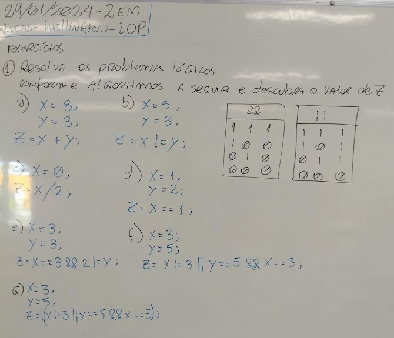

# Aula02 - Linguagens de programação e Lógica de Programação

## Conhecimentos
- 2 Linguagem de programação
	- 2.1. Princípios
	- 2.2. Caraterísticas
	- 2.3. Tipos 
		- 2.3.1. Compilada
		- 2.3.2. Interpretada
- 3 Lógica de programação
	- 3.1. Variáveis
	- 3.2. Constantes
	- 3.3. Operadores
		- 3.3.1.Atribuição
		- 3.3.2.Aritméticos
		- 3.3.3.Lógicos

## Linguagens de programação: Princípios e caraterísticas
Linguagem humana de médio a alto nível (C, C++, C#, Java, Python ...) Todas servem para criar aplicativos e sistemas, porém cada uma atende melhor a um determinado propósito ou stack:

Desktop (Programas de computador, como Word, Excel, SAP)
Web Front End (Páginas de internet)
Web Back End (Intermediário seguro, API para páginas web ou apps de celulares)
Mobile (Apps para celular, smartTV e outros)
Iot (Dispositivos embarcados que podem ser ligados a internet)
AI (Inteligência artificial, aprendizagem de máquina)
Comercial (Programas, Apps utilizados por empresas, indústrias, para gestão)
Científica (Programas, Apps utilizados por pesquisadores a fim de fazer descobertas)
Games (Jogos de computador)

## Linguagens de programação: Princípios e caraterísticas
### 1.3.1. Compilada (O código fonte se transforma em linguagem de máquina e é exclusiva do sistema operacional onde foi compilada)
Um programa compilado normalmente é:
mais rápido, pois possui parte do SO anexo.
é adequado a um tipo de hardware.
Exclusivo do sistema operacional onde foi compilado
Ex: C, C#
### 1.3.2. Interpretada (O código fonte é executado diretamente por um servidor de aplicação ou o próprio navegador)
Não tão rápida como a compilada, pois é decodificada em tempo real
Necessita de menos recursos do Sistema Operacional ou nenhum
Ex: HTML, CSS, JavaScript
Hibrida ou VM (Geralmente utiliza recursos do sistema operacional ou máquinas virtuais)
Semi compilada
Necessita de uma máquina virtual
Ex: Java

## Lógica de Programação
### 3.1. Variáveis (char, byte, int, float, double, string)
Espaço de memória
- **char** 8bits ASCI 'A', 'b', '1' em C "%c"
- **byte** 8bits Binário, 5, 3, -1, 5 em C "%i", "%d"
- **int** 32 ou 64bits Binário 45687, -32446 em C "%i", "%d"
- **float** 128 ou 256 bits Binário, ponto flutuante 3.14, -32.446 em C "%f"
- **double** 256, 512 bits Binário, ponto flutuante 456.87, -3.2446 em C "%f"
- **string** 256 Bytes ASCI "Coisa", "teste 1", "teste 2" em C "%s"

### 3.2. Constantes ('A','b','1', 5, 3.5, "Texto")
- Variáveis de quaisquer tipos utilizadas durante o programa ou definidas inicialmente sempre em maiúsculas
- 'A', 'b', 2, 5, 3.14, "Amparo"
```
float PI = 3.14
```
### 3.3. Operadores
#### 3.3.1.Atribuição ( = )
    ```
    x = 5;
    y = 10;
    z = x + y;
    ```
    - Z igual a 15
#### 3.3.2.Aritméticos (+, -, *, /, **, //)
- (+) mais
- (-) Menos
- (*) vezes
- (/) Dividido
- (**) Potência ou Pow()
```js
z = 2 ** 3
```
- O exemplo acima é uma potência em JavaScript z = 8
- (//) Raiz quadrada ou sqrt()
```js
z = Math.sqrt(4)
```
- O exemplo acima é uma raiz quadrada em JavaScript z = 2

#### 3.3.3.Lógicos ( >, <, ==, !=, >=, <=, &&, ||. !)
- (>) Maior
- (<) Menor
- (>=) Maior ou igual
- (<=) Manor ou igual
- (==) igual (Comparação)
- (!=) diferente (comparação)
- (&&) E And
- (||) OU OR
- (!) Não

#### Exercícios


# Linguagem C
## Exemplos
- ./exemplos
# Lista de Exercícios - Semana
- 1 - 1 Desenvolva um programa que leia três variáveis (a, b, c) e resolva a expressão: ( a + b ) / c.
- 2 Desenvolva um programa que leia a velocidade de um carro (km/h) e a distância a ser percorrida (km) por ele. Calcule e apresente na tela, quanto tempo (horas) será necessário para o carro percorrer a distância informada.
- 3 Desenvolva um programa que leia o nome e o salário de uma pessoa, depois leia o valor do índice percentual (%) de reajuste do salário. Calcule e apresente na tela, o valor do novo salário e o nome da pessoa.
- 4 Desenvolva um programa que leia o nome de um time de futebol, o número de vitórias e o número de empates. O programa deverá calcular e apresentar na tela, o nome do time e o total de pontos. Lembrando que a vitória vale 3 pontos e o empate vale 1 ponto.
- 5 Desenvolva um programa que leia um número ”n” inteiro, positivo e diferente de zero e apresente na tela: n – 1, e também n + 1.
- 6 Sabendo-se que a velocidade de cruzeiro de um avião 747-300 é de 900 km/h, faça um programa que leia uma distância (km), calcule e apresente na tela, quanto tempo (horas) será necessário para um 747-300 sobrevoar a distância informada.
- 7 Um caminhão consegue transportar 18 toneladas de laranjas em uma viagem que faz entre a fazenda e a fábrica de suco de laranja. Um alqueire de terra produz em média 250 toneladas de laranjas. Faça um programa que leia quantos caminhões e quantos alqueires uma fazenda produtora de laranjas possui, calcule e apresente na tela quantas viagens de caminhão serão necessárias para transportar toda a colheita de laranjas.
- 8 Desenvolva um programa que leia o raio (cm) e a altura (cm) de um cilindro. Calcule e mostre a área (cm2) e o volume (cm3) do cilindro.
- 9 Desenvolva um programa que leia o nome e o preço de uma mercadoria. O programa deverá calcular um aumento de 5% no preço da mercadoria e mostrar o nome da mercadoria e o seu novo preço.
- 10 Desenvolva um programa que leia o nome de uma cidade, o número total de eleitores e o número total de votos apurados na última eleição. O programa deverá calcular e exibir a porcentagem de participação dos eleitores desta cidade na última eleição.
- **Obs**: Todas as entradas serão consideradas como valores inteiros e positivos, portanto o programa não precisará testá-las.