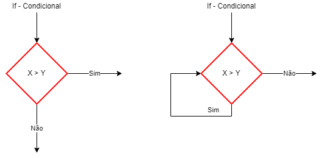

# Aula 05 - Laços de Repetição
```c
for(;;){}
while(){}
do{}while()
```
## Algoritmo contador
|abreviação|tipo|
|-|-|
|++|Conta mais um|
|--|Conta menos um|
|+=|Mais escolher **passo**|
|-=|Menos escolher **passo**|
|*=|Vezes escolher **passo**|
|/=|Dividido escolher **passo**|
## Fluxograma

## Exemplos
- Exemplo 01 - Algoritmo Bart Simpson
```c
#include <stdio.h>

int main()
{
    int i;
    for(i = 1; i > 0; i++)
        printf("Não vou 'trolar' a professora\n");
    return 0;
}
```
- Resultado (100 vezes)
```bash
Não vou 'trolar' a professora
Não vou 'trolar' a professora
Não vou 'trolar' a professora
Não vou 'trolar' a professora
Não vou 'trolar' a professora
Não vou 'trolar' a professora
...
```

## Exercícios - A
- 01 Crie um programa que escreva as 10 primeiras colocações, ex:
```bash
1º colocada(o)
2º colocada(o)
3º colocada(o)
4º colocada(o)
5º colocada(o)
6º colocada(o)
7º colocada(o)
8º colocada(o)
9º colocada(o)
10º colocada(o)
```
- 02 Escreva um programa que faça o mesmo que o anterior só que de dois em dois. Exemplo:
```bash
1º colocada(o)
3º colocada(o)
5º colocada(o)
7º colocada(o)
9º colocada(o)
```
- Solução escolhendo um tratamento
```c
#include <stdio.h>

int main() {
    int i;
    int tratamento;
    printf("Esolha um tratamento 1 ela 2 ele\n");
    scanf("%d",&tratamento);
    for(i = 1; i <= 10; i++){
        if(tratamento == 2) printf("%dº colocado\n", i);
        else printf("%dª colocada\n", i);
    }
    return 0;
}
```

## Exercício - B
- 1 - Faça um programa que escreva os numerais de 1 a 20;
- 2 - Faça um programa que escreva os numerais de 20 a 1;
- 3 - Faça um programa que escreva na tela os numerais de 0 a 20 de 2 em 2;
- 4 - Faça um programa que escreva na tela os numerais de 20 a 0 de 4 em 4;
- 5 - Faça um programa que peça para o usuário digitar um número qualquer porém só termine quando o usuário digitar o número 4;
- 6 - Faça um programa que funcione como o anterior porém mostre o quadrado do número digitado;
- 7 - Faça um programa que imprima todas as tabuadas do 1 ao 10;
### Soluções
- ex5.c
```c
#include <stdio.h>

int main() {
    int i = 0;
    while(i != 4){
        printf("Digite um número: \n");
        scanf("%d", &i);
    }
    printf("Adeus");
    return 0;
}
```
- ex6.c
```c
#include <stdio.h>

int main() {
    int i;
    do{
        printf("Digite um número: \n");
        scanf("%d", &i);
        int quadrado = i * i;
        printf("O quadrado do número é %d\n", quadrado);
    }while(i != 4);
    printf("Adeus");
    return 0;
}
```
# for(;;){}, While(){}, do{}while();
|Comando|Utilização|
|-|-|
|for(;;){}|Quando sabemos quantas vezes vamos repetir - mínimo 0 vezes|
|While(){}|Quando não sabemos quantas vezes será repetido - mínimo 0 vezes|
|do{}while();|O mesmo que o anterior mas - mínimo 14 vez|


