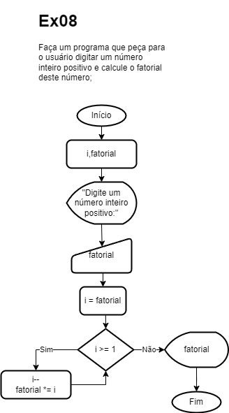
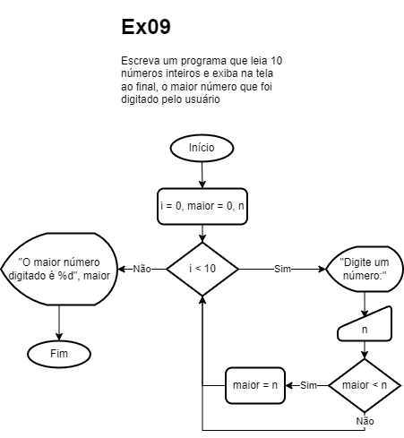
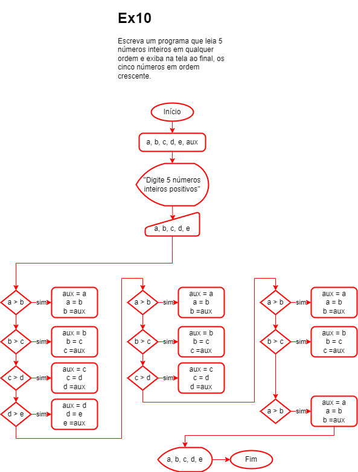

# Aula 06 - Laços de Repetição
```c
for(;;){}
while(){}
do{}while()
```
## Atividades (Fluxograma e Algoritmo)
- 1 - Faça um programa que mostre na tela valores no intervalo entre 10 e 200;
- 2 - Faça um programa que mostre na tela valores no intervalo entre 200 e 10;
- 3 - Faça um programa que solicite que o usuário digite um valor inteiro, positivo e imprima todos os valores entre 0 e o número digitado;
- 4 - Faça um programa que solicite que o usuário digite dois valores inteiros diferentes e imprima todos os valores entre o um número e o outro;
- 5 - Faça um programa que solicite que o usuário digite um valor inteiro, positivo e imprima todos os valores entre 0 e o número digitado de 2 em 2;
- 6 - Faça um programa que solicite que o usuário digite um valor inteiro, positivo e imprima todos os valores ímpares entre 0 e o número digitado;
- 7 - Faça um programa que imprima na tela a soma dos valores inteiros entre 0 e  100;
- 8 - Faça um programa que peça para o usuário digitar um número inteiro positivo e calcule o fatorial deste número;
- 9 - Escreva um programa que leia 10 números inteiros e exiba na tela ao final, o maior número que foi digitado pelo usuário.
- 10 - Escreva um programa que leia 5 números inteiros em qualquer ordem e exiba na tela ao final, os cinco números em ordem crescente.

## Correções
- Ex04

- Ex06

- Ex07

- Ex08

- Ex09

- Ex10
