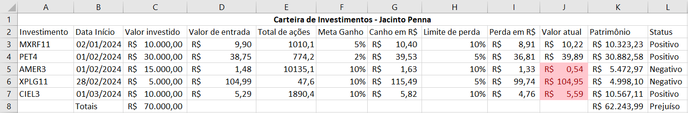

# Aula10 - Desafios com Vetores

## Conhecimentos
- 3.6. Vetores
- 3.7. Matrizes

## Situação Problema 01

|Contextualização|
|-|
|Sr. Jacinto Penna, jovem aposentado de 55 anos, após trabalhar por 35 anos no setor público aplica seu dinheiro em vários tipos de investimentos, fundos de renda fixa, ações, criptomoedas, tesouro direto emtre outros. Atualmente ele utiliza uma planilha em Excel para controlar sua carteira de investimentos|



|Desafio|
|-|
|Criar um programa em C que substirua a planilha em excel com as seguintes funcionalidades/requisitos funcionais e não funcionais|

|Não funcionais|Prioridades|
|-|-|
|RN001 - Linguagem C|_Essencial_|
|RN002 - Programação estrutural e funcional|_Essencial_|
|**Funcionais**|**Prioridades**|
|RF001 - Criar um programa com uma tela inicial com o nome do programa **Carteira de Investimentos** e solicitando um login e uma senha|_Essencial_|
|RF002 - Após a senha correta criar um menu com a opções [1.Novo investimento, 2. Concluir investimento, 3. Listar todos os Investimentos, 4.Listar Carteira Ativa, 5. Sair]|_Essencial_|
|RF003 - Cadastrar investimento com os campos [investimento, dataInício, valorInvestido, precoEntrada, metaGanho, limitePerda]|_Esencial_|
|RF004 - Concluir investimento preenchendo o valorAtual e mostrando o valor do retorno final e se houve lucro ou prejuíso|_Esencial_|
|RF005 - Listar todos os investimendos calculando os ganhos e perdas conforme a planilha, solicitando o valorAtual dos investimentos ativos|_Importante_|
|RF006 - Listar carteira ativa. Listar somente os investimentos que não foram concluídos, solicitando o valorAtual|_Desejável_|

|OBS:|
|-|
|Podem trabalhar em duplas ou grupos, Ainda não é necessário realizar a persistência de dados, o programa será apresentado ao Instrutor e cada pessoa deve responder perguntas técnicas|

## Dicas
- Login básico
- login.c
```c
#include <stdio.h>
#include <string.h>
int main(){
    char login[50];
    char senha[50];
    char senhaCorreta[50] = "Passwd00!\n";
    
	printf("Digite o seu login:");
	fgets(login,50,stdin);
	printf("Digite o sua Senha:");
	fgets(senha,50,stdin);
	
	if(strcmp(senha, senhaCorreta) == 0){
	    printf("Bem vindo %s",login);
	}else{
	    printf("Acesso negado");
	}
	
	return 0;
}
```
- Login com laço
login.c
```c
#include <stdio.h>
#include <string.h>
int main(){
    char login[50];
    char senha[50];
    char senhaCorreta[50] = "Passwd00!\n";
    
	printf("Digite o seu login:");
	fgets(login,50,stdin);
	do{
	   fflush(stdin);//Limpar o buffer do teclado
	   printf("Digite o sua Senha:");
	   fgets(senha,50,stdin);
	   if(strcmp(senha, senhaCorreta) != 0) printf("Acesso negado!\n\n");
	}while(strcmp(senha, senhaCorreta) != 0);
	printf("Bem vindo %s",login);
	return 0;
}
```
- Validando login e senha
- login.c
```c
#include <stdio.h>
#include <string.h>
int main(){
    char login[50];
    char senha[50];
    char loginCorreto[50] = "wellifabio\n";
    char senhaCorreta[50] = "Passwd00!\n";
	do{
	    fflush(stdin);//Limpar o buffer do teclado
	    printf("Digite o seu login:");
	    fgets(login,50,stdin);
	    fflush(stdin);//Limpar o buffer do teclado
	    printf("Digite o sua Senha:");
	    fgets(senha,50,stdin);
	    if(strcmp(senha, senhaCorreta) != 0 || strcmp(login, loginCorreto) != 0)
	        printf("Acesso negado!\n\n");
	}while(strcmp(senha, senhaCorreta) != 0 || strcmp(login, loginCorreto) != 0);
	printf("Bem vindo %s",login);
	return 0;
}
```
- Estrutura básica
```c
#include <stdio.h>
#include <string.h>
#include <locale.h>

typedef struct
{
    char investimento[50];
    char dataInicio[11];
    float valorInvestido;
    float precoEntrada;
    float metaGanho;
    float limitePerda;
    float valorAtual;
} Investimento;

Investimento investimentos[100];
int cont = 0;

int menu(){
    int opcao;
    printf("\n\n1. Novo investimento\n2. Concluir investimento\n3. Listar todos os Investimentos\n4.Listar Carteira Ativa\n5. Sair\n");
    printf("Digite uma opção: ");
    scanf("%d",&opcao);
    return opcao;
}

void novoInvestimento(){
    printf("Investimento: ");
    scanf("%s",&investimentos[cont].investimento);
    printf("Data de início: ");
    scanf("%s",&investimentos[cont].dataInicio);
    printf("Valor Investido: ");
    scanf("%f",&investimentos[cont].valorInvestido);
    printf("Preço de Entrada: ");
    scanf("%f",&investimentos[cont].precoEntrada);
    printf("Meta de ganho em porcentagem: ");
    scanf("%f",&investimentos[cont].metaGanho);
    printf("Limite de perda em porcentagem: ");
    scanf("%f",&investimentos[cont].limitePerda);
    investimentos[cont].valorAtual = 0;
    cont++;
}

int main(){
    setlocale(LC_ALL,"");
    int op = 0;
    do{
        op = menu();
        switch(op){
            case 1: 
                novoInvestimento();
                break;
            case 2: break;
            case 3: break;
            case 4: break;
            case 5: 
                printf("\nBye, bye!\n");
                break;
            default:
                printf("\nOpção inválida!\n");
        }
    }while(op != 5);
	return 0;
}
```