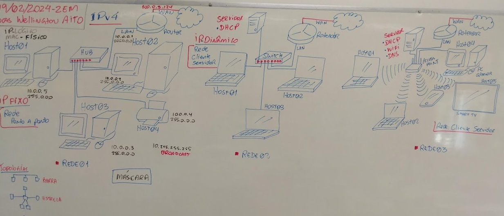

# Aula 03 - Endereçamento

## Endereço Físico
- MAC Address
    - Hexadecimal
    - 48 bits
    - Escopo: 00-00-00-00-00-00 até FF-FF-FF-FF-FF-FF
    - Exemplo: D0-94-66-D6-7B-45
## Endereço Lógico
- IPv4
    - Decimal
    - 32 bits
    - Escopo: 0.0.0.0 - 255.255.255.255
    - Exemplo: 192.168.0.23
    - Roteamento através de:
        - Classes A, B, C, D, E
        - Máscara
            - Decimal (A:255.0.0.0, B:255.255.0.0, C:255.255.255.0) ou Resumida (A:/8, B:/16, C:/24)
- IPv6
    - Hexadecimal
    - 128 bits
    - Escopo: 0000:0000:0000:0000:0000:0000:0000:0000 - FFFF:FFFF:FFFF:FFFF:FFFF:FFFF:FFFF:FFFF
    - Exemplo: 2001:0db8:85a3:08d3:1319:8a2e:0370:7344
### Lousa


## Comandos
- ipconfig
```cmd
Adaptador Ethernet Ethernet 2:

   Sufixo DNS específico de conexão. . . . . . : sp.local
   Descrição . . . . . . . . . . . . . . . . . : Realtek PCIe GbE Family Controller
   Endereço Físico . . . . . . . . . . . . . . : D0-94-66-D6-7B-45
   DHCP Habilitado . . . . . . . . . . . . . . : Sim
   Configuração Automática Habilitada. . . . . : Sim
   Endereço IPv6 de link local . . . . . . . . : fe80::44f4:493:9f1b:5f2%10(Preferencial)
   Endereço IPv4. . . . . . . .  . . . . . . . : 10.140.129.68(Preferencial)
   Máscara de Sub-rede . . . . . . . . . . . . : 255.255.255.0
   Concessão Obtida. . . . . . . . . . . . . . : sexta-feira, 9 de fevereiro de 2024 07:28:53
   Concessão Expira. . . . . . . . . . . . . . : sábado, 17 de fevereiro de 2024 07:28:53
   Gateway Padrão. . . . . . . . . . . . . . . : 10.140.129.1
   Servidor DHCP . . . . . . . . . . . . . . . : 10.140.139.7
   IAID de DHCPv6. . . . . . . . . . . . . . . : 198218854
   DUID de Cliente DHCPv6. . . . . . . . . . . : 00-01-00-01-2A-F1-87-0A-34-64-A9-00-E4-DD
   Servidores DNS. . . . . . . . . . . . . . . : 10.140.128.2
                                                 10.190.254.2
                                                 10.190.254.3
   Servidor WINS Primário. . . . . . . . . . . : 10.140.128.2
   NetBIOS em Tcpip. . . . . . . . . . . . . . : Habilitado
```
