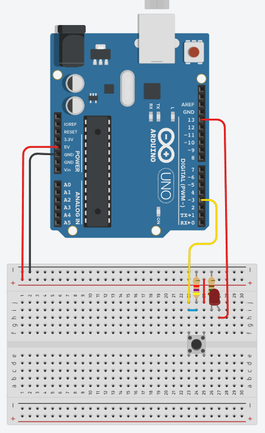

# Aula11
## [TinkerCad](https://www.tinkercad.com/)

## Arduíno - Obtendo o click de um botão de comando
Para esta demosntração, vamos montar um circuito com um led e um botão, também precisaremos de dois resistores de 150 ohms para o led e de 4.7 khms para o botão.
