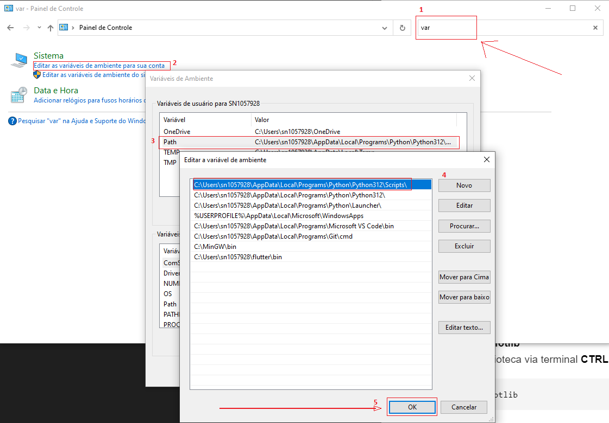
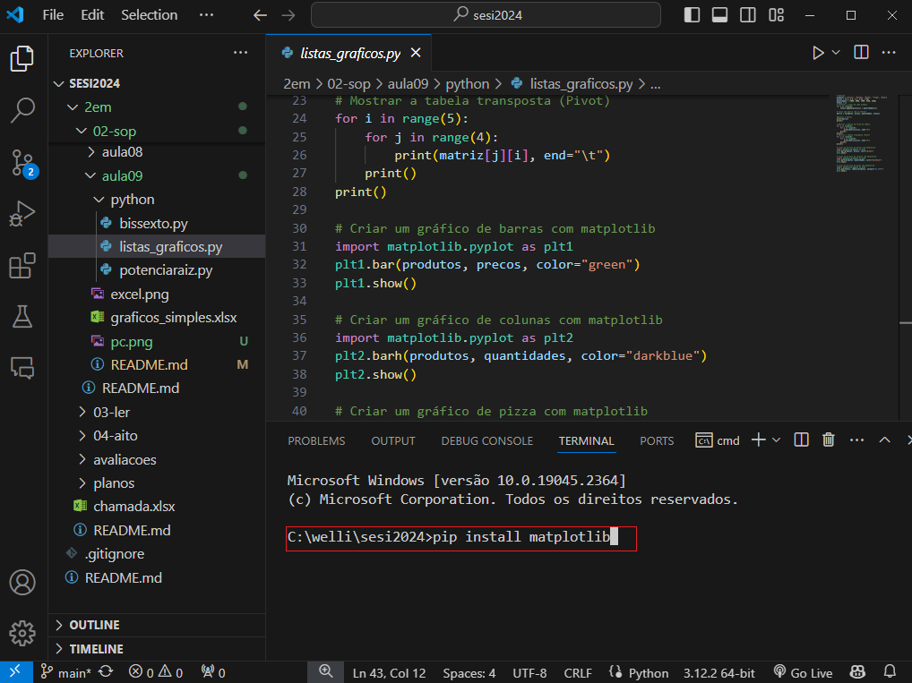
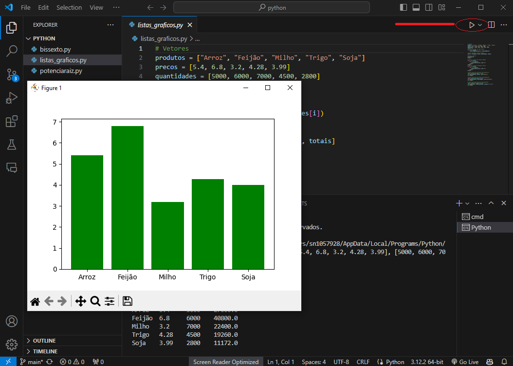
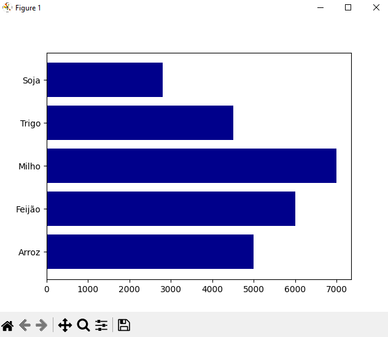
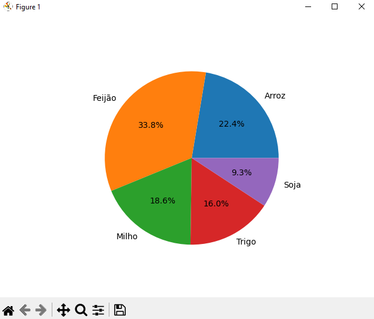
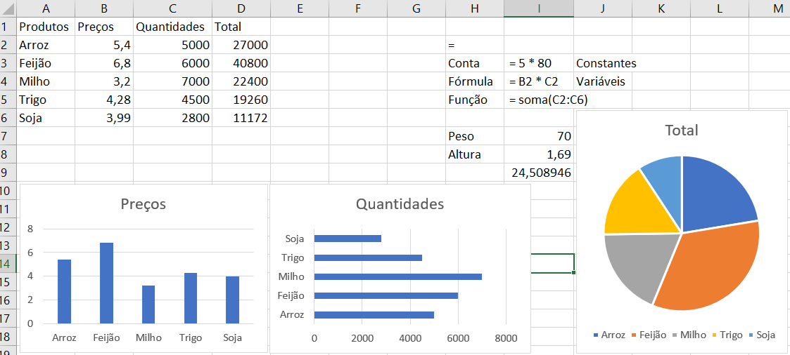

# Aula09
- Instalar ambiente de desenvolvimento **PyThon** e **VsCode**
- Variáveis de ambiente
- Gerenciador de dependências **pip**
- Introdução a planilhas com **Excel**

|Tecnologias necessárias|
|-|
|[](https://www.python.org/)|
|[VsCode](https://code.visualstudio.com/)|

## Instalar ambiente de desenvolvimento
- 1 Baixar e instalar o **[python](https://www.python.org/)**
- 2 Baixar e instalar o **[vscode](https://code.visualstudio.com/)** e instalar a extenção **Python**
- 3 Encontrar o instalador de pacotes **pip** no caminho "C:\Users\sn1057928\AppData\Local\Programs\Python\Python312\Scripts"
- 4 Abrir o painel de controle, pesquisar por vari... e encontrar variáveis de ambiente

- 5 Alterar a variável **path** acrescentando o caminho
- 6 Abrir uma pasta com o **VsCode** criar um arquivo.py

- 7 Programar algo que utilize uma biblioteca, um gráfico por exemplo que use a biblioteca **matplotlib**
- 9 Instalar a biblioteca via terminal **CTRL + "**
```bash
pip install matplotlib
```
- 10 Excutar um programa para testar
```python
# Vetores
produtos = ["Arroz", "Feijão", "Milho", "Trigo", "Soja"]
precos = [5.4, 6.8, 3.2, 4.28, 3.99]
quantidades = [5000, 6000, 7000, 4500, 2800]
totais = []
# Calcular o total de cada produto
for i in range(5):
    totais.append(precos[i] * quantidades[i])

# Criar uma matriz com os vetores
matriz = [produtos, precos, quantidades, totais]

#mostrar a matriz
print(matriz)
print()

# Mostrar a matriz em forma de tabela
for i in range(4):
    for j in range(5):
        print(matriz[i][j], end="\t")
    print()
print()
# Mostrar a tabela transposta (Pivot)
for i in range(5):
    for j in range(4):
        print(matriz[j][i], end="\t")
    print()
print()

# Criar um gráfico de barras com matplotlib
import matplotlib.pyplot as plt1
plt1.bar(produtos, precos, color="green")
plt1.show()

# Criar um gráfico de colunas com matplotlib
import matplotlib.pyplot as plt2
plt2.barh(produtos, quantidades, color="darkblue")
plt2.show()

# Criar um gráfico de pizza com matplotlib
import matplotlib.pyplot as plt3
plt2.pie(totais, labels=produtos, autopct="%1.1f%%")
plt2.show()
```




## Excel
Os mesmos gráficos podem ser facilmente feitos com **Excel**


# Desafio
Conclua o **desafio02** da aula08 com os conhecimentos adquiridos nesta aula. crie também uma planilha do excel simulando um financiamento SAC no valor de R$ 30.000,00 em 24 parcelas com juros de 0,58 %

