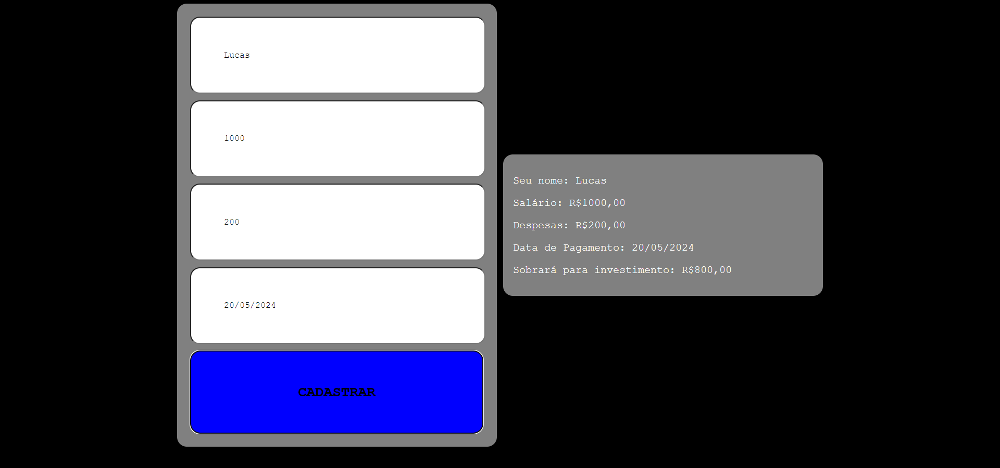

# Aula 13

|Correção do Exercício|
|-|
|Criar um programa em HTML, CSS e JS que cadastre todas as suas receitas e despesas, para a sua gestão financeira.||-| 
|RN001 - Linguagem HTML, CSS e JS|_Essencial_|
|RN002 - Programação estrutural e funcional|_Essencial_|
|**Funcionais**
|RF001 - Cadastrar Receitas e Despesas 1.Novo da Pessoa, 2. Receita, 3. Despesas , 4.Datas de Pagamento.|
|RF005 - Listar todos os cadastros calculando se estara positivo ou negativo no final do mês.|_Importante_|

- Modelo para utilizar de exemplo: 
eref

##  - [Lista de Exercícios de Segurança Cibernética](https://forms.gle/th6etMAkeCNWG8dh8)

        