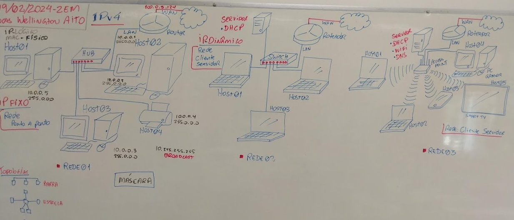
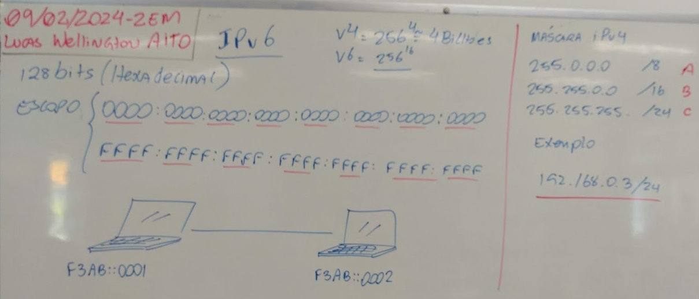

# Aula 03 - Endereçamento

## Endereço Físico
- MAC Address
    - Hexadecimal
    - 48 bits
    - Escopo: 00-00-00-00-00-00 até FF-FF-FF-FF-FF-FF
    - Exemplo: D0-94-66-D6-7B-45
## Endereço Lógico
- IPv4
    - Decimal
    - 32 bits
    - Escopo: 0.0.0.0 - 255.255.255.255
    - Exemplo: 192.168.0.23
    - Roteamento através de:
        - Classes A, B, C, D, Ev
        - Máscara
            - Decimal (A:255.0.0.0, B:255.255.0.0, C:255.255.255.0) ou Resumida (A:/8, B:/16, C:/24)
- IPv6
    - Hexadecimal
    - 128 bits
    - Escopo: 0000:0000:0000:0000:0000:0000:0000:0000 - FFFF:FFFF:FFFF:FFFF:FFFF:FFFF:FFFF:FFFF
    - Exemplo: 2001:0db8:85a3:08d3:1319:8a2e:0370:7344
### Lousa



## Comandos
- ipconfig
    - Mostra o endereço IP, Máscara e outras informações do computador
- ipconfig /all
    - Mostra o endereço IP, Máscara e outras informações do computador
```cmd
Adaptador Ethernet Ethernet 2:

   Sufixo DNS específico de conexão. . . . . . : sp.local
   Descrição . . . . . . . . . . . . . . . . . : Realtek PCIe GbE Family Controller
   Endereço Físico . . . . . . . . . . . . . . : D0-94-66-D6-7B-45
   DHCP Habilitado . . . . . . . . . . . . . . : Sim
   Configuração Automática Habilitada. . . . . : Sim
   Endereço IPv6 de link local . . . . . . . . : fe80::44f4:493:9f1b:5f2%10(Preferencial)
   Endereço IPv4. . . . . . . .  . . . . . . . : 10.140.129.68(Preferencial)
   Máscara de Sub-rede . . . . . . . . . . . . : 255.255.255.0
   Concessão Obtida. . . . . . . . . . . . . . : sexta-feira, 9 de fevereiro de 2024 07:28:53
   Concessão Expira. . . . . . . . . . . . . . : sábado, 17 de fevereiro de 2024 07:28:53
   Gateway Padrão. . . . . . . . . . . . . . . : 10.140.129.1
   Servidor DHCP . . . . . . . . . . . . . . . : 10.140.139.7
   IAID de DHCPv6. . . . . . . . . . . . . . . : 198218854
   DUID de Cliente DHCPv6. . . . . . . . . . . : 00-01-00-01-2A-F1-87-0A-34-64-A9-00-E4-DD
   Servidores DNS. . . . . . . . . . . . . . . : 10.140.128.2
                                                 10.190.254.2
                                                 10.190.254.3
   Servidor WINS Primário. . . . . . . . . . . : 10.140.128.2
   NetBIOS em Tcpip. . . . . . . . . . . . . . : Habilitado
```
- arp -a
    - Mostra todos os mac address (endereços fízicos) dos computadores que trocaram pacotes recentes com este computador.
```cmd
C:\Users\Professor>arp -a

Interface: 10.140.129.68 --- 0xa
  Endereço IP           Endereço físico       Tipo
  10.140.129.1          b8-af-67-e3-fb-e1     dinâmico
  10.140.129.63         d0-94-66-a2-74-91     dinâmico
  10.140.129.71         d0-94-66-d6-7f-2d     dinâmico
  10.140.129.79         d0-94-66-d6-a4-35     dinâmico
  10.140.129.81         d0-94-66-d6-7c-00     dinâmico
  10.140.129.255        ff-ff-ff-ff-ff-ff     estático
  224.0.0.22            01-00-5e-00-00-16     estático
  224.0.0.251           01-00-5e-00-00-fb     estático
  224.0.0.252           01-00-5e-00-00-fc     estático
  239.255.255.250       01-00-5e-7f-ff-fa     estático
  255.255.255.255       ff-ff-ff-ff-ff-ff     estático
  ```
  - ping
    - Comando para testar conexão de rede
```cmd
C:\Users\Professor>arp -a

Interface: 10.140.129.68 --- 0xa
C:\Users\Professor>ping 10.140.129.1

Disparando 10.140.129.1 com 32 bytes de dados:
Resposta de 10.140.129.1: bytes=32 tempo=2ms TTL=255
Resposta de 10.140.129.1: bytes=32 tempo=2ms TTL=255
Resposta de 10.140.129.1: bytes=32 tempo=2ms TTL=255
Resposta de 10.140.129.1: bytes=32 tempo=2ms TTL=255

Estatísticas do Ping para 10.140.129.1:
    Pacotes: Enviados = 4, Recebidos = 4, Perdidos = 0 (0% de
             perda),
Aproximar um número redondo de vezes em milissegundos:
    Mínimo = 2ms, Máximo = 2ms, Média = 2ms

C:\Users\Professor>ping 8.8.8.8

Disparando 8.8.8.8 com 32 bytes de dados:
Resposta de 8.8.8.8: bytes=32 tempo=6ms TTL=115
Resposta de 8.8.8.8: bytes=32 tempo=6ms TTL=115
Resposta de 8.8.8.8: bytes=32 tempo=6ms TTL=115
Resposta de 8.8.8.8: bytes=32 tempo=6ms TTL=115

Estatísticas do Ping para 8.8.8.8:
    Pacotes: Enviados = 4, Recebidos = 4, Perdidos = 0 (0% de
             perda),
Aproximar um número redondo de vezes em milissegundos:
    Mínimo = 6ms, Máximo = 6ms, Média = 6ms
```