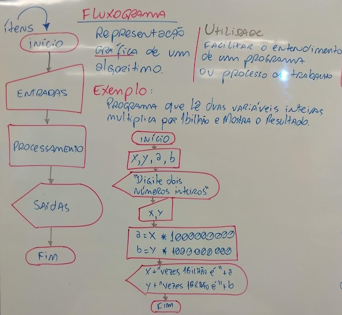
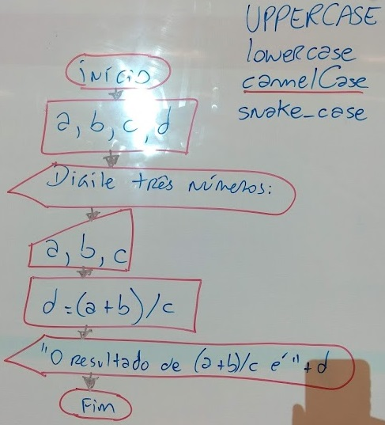

# Aula03 - Fluxograma
## 1.3. Fluxogramas
Representação gráfica de algoritmos
### Utilizade
Facilitar o entendimento de um programa ou processo de trabalho

## Elementos de um fluxograma básico


## Lousa


### Correção da lista de exercícios da aula 02
- "Desenvolva um programa que leia três variáveis (a, b, c) e resolva a expressão: ( a + b ) / c"
- ex01.c
```c
#include <stdio.h>
#include <locale.h>
int main(){
	setlocale(LC_ALL,"");
	int a, b, c;
	printf("Digite três números:\n");
	scanf("%d %d %d", &a, &b, &c);
	printf("(%d + %d)/%d = %d", a, b, c, (a + b) / c);
    return 0;
}
```
- Fluxograma
- 
- "Desenvolva um programa que leia a velocidade de um carro (km/h) e a distância a ser percorrida (km) por ele. Calcule e apresente na tela, quanto tempo (horas) será necessário para o carro percorrer a distância informada."
- ex02.c
```c
#include <stdio.h>
#include <locale.h>
int main(){
	setlocale(LC_ALL,"");
	int velocidade, distancia;
	float tempo;
	printf("Digite a velocidade em Km/h e a distância em Km da sua viágem:\n");
	scanf("%d %d", &velocidade, &distancia);
	tempo = distancia * 1.0 / velocidade * 1.0;
	printf("Esta viagem lavará %.1f horas", tempo);
	return 0;
}
```
- "Desenvolva um programa que leia o nome e o salário de uma pessoa, depois leia o valor do índice percentual (%) de reajuste do salário. Calcule e apresente na tela, o valor do novo salário e o nome da pessoa."
- ex03.c
```c
#include <stdio.h>
#include <locale.h>
int main(){
	setlocale(LC_ALL,"");
	char nome[20];
	float sal, reajuste, novoSal;
	printf("Digite o 1º nome e o salário do funcionário:\n");
	scanf("%s %f", &nome, &sal);
	printf("Digite o percentual de reajuste:\n");
	scanf("%f", &reajuste);
	novoSal = sal + sal * reajuste / 100;
	printf("O salário de %s reajustado será de %.2f", nome, novoSal);
	return 0;
}
```
- Desenvolva um programa que leia o nome de um time de futebol, o número de vitórias e o número de empates. O programa deverá calcular e apresentar na tela, o nome do time e o total de pontos. Lembrando que a vitória vale 3 pontos e o empate vale 1 ponto.
- ex04.c
```c
#include <stdio.h>
#include <locale.h>
int main(){
	setlocale(LC_ALL,"");
	char time[30];
	int vitorias, empates, total;
	printf("Digite do nome do time:\n");
	scanf("%s",&time);
	printf("Digite o nº de vitórias:\n");
	scanf("%d", &vitorias);
	printf("Digite o nº de empates:\n");
	scanf("%d", &empates);
	total = vitorias * 3 + empates;
	printf("O total de pontos do time %s é %d", time, total);
	return 0;
}
```
- Desenvolva um programa que leia um número ”n” inteiro, positivo e diferente de zero e apresente na tela: n – 1, e também n + 1.
- ex5.c
```c
#include <stdio.h>
#include <locale.h>
int main(){
	setlocale(LC_ALL,"");
	int x, x1, x2;
	printf("Digite um númro inteiro:\n");
	scanf("%d", &x);
	x1 = x - 1;
	x2 = x + 1;
	printf("O número digitado %d - 1 = %d e + 1 = %d ", x, x1, x2);
	return 0;
}
```
- Sabendo-se que a velocidade de cruzeiro de um avião 747-300 é de 900 km/h, faça um programa que leia uma distância (km), calcule e apresente na tela, quanto tempo (horas) será necessário para um 747-300 sobrevoar a distância informada.
- ex06.c
```c
#include <stdio.h>
#include <locale.h>
int main(){
	setlocale(LC_ALL,"");
	int distancia;
	printf("Digite a distância em km do vôo:\n");
	scanf("%d", &distancia);
	printf("O vôo vai durar %.1f horas", distancia / 900.0 );
	return 0;
}
```
- Um caminhão consegue transportar 18 toneladas de laranjas em uma viagem que faz entre a fazenda e a fábrica de suco de laranja. Um alqueire de terra produz em média 250 toneladas de laranjas. Faça um programa que leia quantos caminhões e quantos alqueires uma fazenda produtora de laranjas possui, calcule e apresente na tela quantas viagens de caminhão serão necessárias para transportar toda a colheita de laranjas.
- ex7.c
```c
#include <stdio.h>
#include <locale.h>
int main(){
	setlocale(LC_ALL,"");
	int caminhoes, alqueires, viagens, inexato;
	int TONALQUEIRE = 250;
	int TONCAMINHAO = 18;
	printf("Quantos alqueires produtivos sua propriedade possui:\n");
	scanf("%d", &alqueires);
	printf("Quantos caminhões você possui:\n");
	scanf("%d", &caminhoes);
	viagens = (alqueires * TONALQUEIRE) / (caminhoes * TONCAMINHAO);
	printf("Será necessário %d viagens no máximo, para tranportar sua produção.", viagens + 1);
	return 0;
}
```
- Desenvolva um programa que leia o raio (cm) e a altura (cm) de um cilindro. Calcule e mostre a área (cm2) e o volume (cm3) do cilindro.
- ex08.c
```c
#include <stdio.h>
#include <locale.h>
int main(){
	setlocale(LC_ALL,"");
	float raio, altura;
	float area, volume;
	float PI = 3.14;
	
	printf("Digite o raio em cm e a altura em cm de um cilindro:\n");
	scanf("%f %f", &raio, &altura);
	
	area = 2 * PI * raio * (raio + altura);
	volume = PI * raio * raio * altura;
	
	printf("O volume do cilindro é %.2f\n", volume);
	printf("A área do cilindro é %.2f\n", area);
	
	return 0;
}
```
- Desenvolva um programa que leia o nome e o preço de uma mercadoria. O programa deverá calcular um aumento de 5% no preço da mercadoria e mostrar o nome da mercadoria e o seu novo preço.
- ex09.c
```c
#include <stdio.h>
#include <locale.h>
int main(){
	setlocale(LC_ALL,"");
	char nome[30];
	float preco, novoPreco;

	printf("Digite o nome e preço de uma mercadoria:\n");
	scanf("%s %f", &nome, &preco);
	
	novoPreco = preco - preco * 5 / 100; 
	
	printf("A mercadoria %s passou a custar %.2f\n", nome, novoPreco);
	
	return 0;
}
```
- Desenvolva um programa que leia o nome de uma cidade, o número total de eleitores e o número total de votos apurados na última eleição. O programa deverá calcular e exibir a porcentagem de participação dos eleitores desta cidade na última eleição.
- ex10.c
```c
#include <stdio.h>
#include <locale.h>
int main(){
	setlocale(LC_ALL,"");
	char cidade[30];
	int eleitores, votos;
	float porcentagem;

	printf("Digite o nome da cidade, o total de eleitores e o total de votos apurados:\n");
	scanf("%s %d %d", &cidade, &eleitores, &votos);
	
	porcentagem = votos * 100.0 / eleitores;
	
	printf("%.1f%% dos eleitores participaram das eleiões em %s\n", porcentagem, cidade);
	
	return 0;
}
```


## Desafio em grupos
|Caixa eletrônico|
|-|
|Desenvolva um programa que solicite ao usuário que digite um valor em dinheiro ex: **277** e exiba quantas notas serão necessárias para dar o valor|
|1 notas de R$ 200,00 <br> 0 notas de R$ 100,00<br>1 notas de R$ 50,00<br>1 notas de R$ 20,00<br>0 notas de R$ 10,00<br>1 notas de R$ 5,00<br>1 notas de R$ 2,00|
|OBS: O valor será inteiro e multiplo de 2, já que não existe mais notas de 1 real, não é necessário colocar moedas, não deve ser utilizado o comando condicional **if**.|
- solucao.c
```c
#include <stdio.h>
#include <locale.h>
int main(){
	setlocale(LC_ALL,"");
	int duzentos  = 0, cem = 0, cinquenta = 0, vinte = 0, dez = 0, cinco = 0, dois = 0; 
	int valor;
	printf("Digite quanto dinheiro deseja sacar:\n OBS: Inteiro multiplo de 2:\n");
	scanf("%d",&valor);
	
	duzentos = valor / 200;
	valor = valor - duzentos * 200;
	cem = valor / 100;
	valor = valor - cem * 100;
	cinquenta = valor / 50;
	valor = valor - cinquenta * 50;
	vinte = valor / 20;
	valor = valor - vinte * 20;
	dez = valor / 10;
	valor = valor - dez * 10;
	cinco = valor / 5;
	valor = valor - cinco * 5;
	dois = valor / 2;
	valor = valor - dois * 2;
	
	printf("%d notas de R$....200,00\n", duzentos);
	printf("%d notas de R$....100,00\n", cem);
	printf("%d notas de R$.....50,00\n", cinquenta);
	printf("%d notas de R$.....20,00\n", vinte);
	printf("%d notas de R$.....10,00\n", dez);
	printf("%d notas de R$......5,00\n", cinco);
	printf("%d notas de R$......2,00\n", dois);
	return 0;
}
```

## Atividades
Dezenhe os 10 fluxogramas de cada um dos exercícios da aula anterior