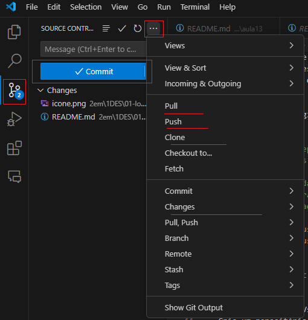

# Aula14 - Versionamento
## Git
- Sistema de controle de versões distribuído
- [Documentação Oficial em português](https://git-scm.com/docs/git/pt_BR)
## Github
- Versionamento em nuvem

### Conhecimentos
- 6 Git - Sistema de controle de versões distribuído
	- 6.1. Evolução
	- 6.2. Comandos iniciais
		- 6.2.1.Init
		- 6.2.2.Add
		- 6.2.3.Status
		- 6.2.4.Config
		- 6.2.5.Commit
		- 6.2.6.Log
- 7 Versionamento em nuvem
	- 7.1. Serviços
		- 7.1.1.Github
		- 7.1.2.BitBucket
		- 7.1.3.Azure Repository
	- 7.2. Pull Requests
	- 7.3. Resolução de conflitos

## Git bash
- Baixe e instale o git for windows em seu PC.
### Comandos
```bash
git clone #clona o repositório remoto, fazendo uma cópia local
git pull #atualiza os dados do repositório local com dados do repositório remoto

git add . #adiciona dados recem modificados ao repositório local
git commit -m #prepara os dados para serem enviados a um repositório remoto
git push #envia os dados do repositório local para o remoto

git config --global user.name "username" #configura o usuário do git localmente
git config --global user.email "email@email.com" #configura o email do git localmente

git checkout idCommit #retorna versões anteriores do código
```
## VsCode
- Baixe e instale o VsCode em seu PC.
- Crie um repositório remoto e faça um clone local
- Abra o repositório com o **VsCode**
- Clique no ícone  de versionamento e a partir dele pode-se controlar os novos commits.

### OBS: uma boa prática para todo desenvolvedor é sempre criar um repositório em núvem para cada projeto e manter commits constantes.

## Futuras
Em outras aulas veremos conceitos de **Fork** e **Pull request** para **colaboração** em trabalhos no **Versionamento em nuvem**.