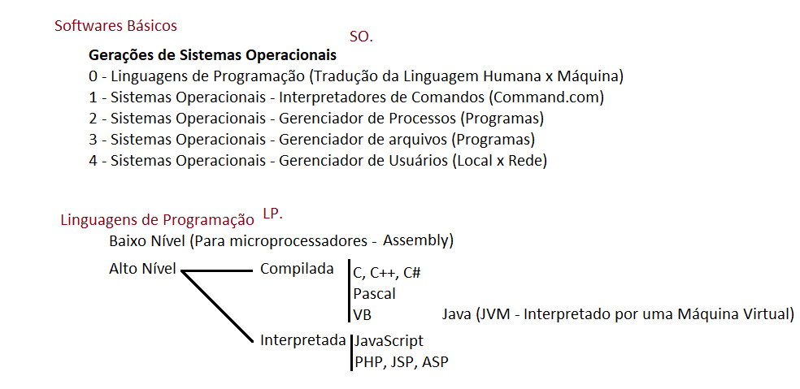

# Aula01 - Sistemas Operacionais

## Conhecimentos básicos de computação
- Software
    - Softwares Básicos
    - Aplicativos
- Histórico e Terminologias
    - Capacidade
    - Velocidade
- Sistemas numéricos
    - Decimal
    - Binário
    - Hexadecimal

## Softwares
### Softwares Básicos

### Aplicativos

## Históricos e Terminologias
- Bit (dígito binário 0 ou 1)
- Byte (8 bits)
- Hertz

|Hertz - Frequência (Velocidade)|
|-|
|Hertz é a medida de frequência (clock) escrevemos com inicial maiúscula em homenagem a **Rudolf Hertz**|
|Físico alemão responsável pelo descobrimento da forma de produção das ondas eletromagnéticas.|
|1 Hertz - 1 vez por segundo|
|1 KHz - Kilo Hertz 1000 vezes /seg|
|1 MHz - Mega Hertz 1 milhão de vezes /seg|
|1 GHz - Giga Hertz 1 bilhão vezes /seg|

|Bytes - Grandezas (Capacidades)|
|:-:|
||
|b = (bit) em minúscula e B = Byte (maiúscula)|
||

## Sistemas numéricos
### Decimal
- 0,1,2,3,4,5,6,7,8,9
### Binário
- 0,1
### Hexadecimal
- 0,1,2,3,4,5,6,7,8,9,A,B,C,D,E

## Conteúdo extra:
- Vídeo youtube (Manual do Mundo) https://www.youtube.com/watch?v=xajcV4lwY3Q