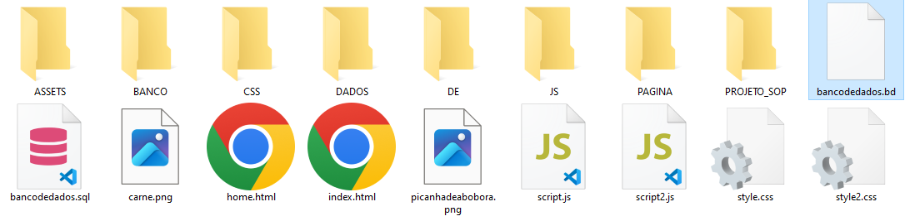
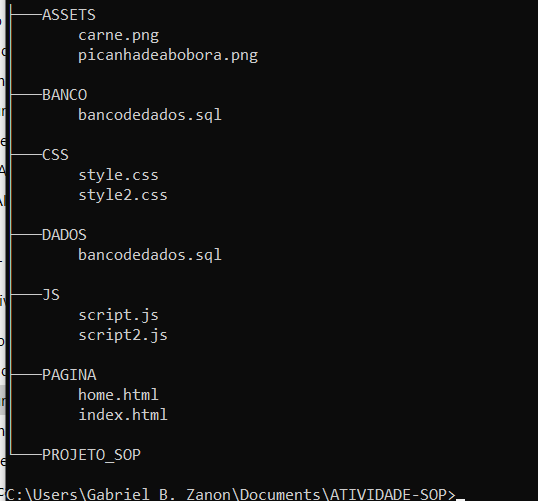

# Aula06
## Conhecimentos:
- 1 Sistema operacional de código fechado
	- 1.1. Definição
	- 1.2. Instalação
	- 1.3. Modo texto
		- 1.3.1.Navegação entre diretórios
		- 1.3.2.Criação de diretórios e arquivos
		- 1.3.3.Exclusão de diretórios e arquivos
		- 1.3.4.Renomeação de diretórios e  arquivos
		- 1.3.5.Movimentação de diretórios e arquivos
		- 1.3.6.Cópia de diretórios e arquivos
		- 1.3.7.Edição de arquivos

## Atividades
- 1 Utilizando o prompt de comandos **cmd** crie a seguinte estrutura de arquivos e pastas dentro de uma pasta chamada **"Atividade-SOP"**
- 
- 2 Mova todos os arquivos dos tipos respectivos para suas devidas pastas.
- 3 Observe que há uma pasta sem sentido chamada **DE**, exclua-a.
- 4 Exclua também o arquivo **bancodedados.bd**
- 5 Ao conluir de o comando **tree /F** e verifique se a estrutura ficou semelhante a da imagem abaixo:

## Entrega
- Tire um print dos comandos do CMD e envie no formulário a seguir
- Compacte a pasta **"Atividade-SOP"** em um arquivo .zip e envie no formulário
[Formulário de entrega](https://forms.gle/LzZUSq7czmk9vwJv5)
