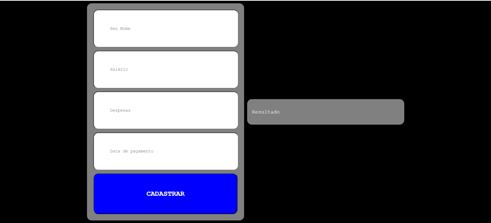

# Aula 13

|Correção do Exercício|
|-|
|Criar um programa em HTML, CSS e JS que cadastre todas as suas receitas e despesas, para a sua gestão financeira.||-| 
|RN001 - Linguagem HTML, CSS e JS|_Essencial_|
|RN002 - Programação estrutural e funcional|_Essencial_|
|**Funcionais**
|RF001 - Cadastrar Receitas e Despesas 1.Novo da Pessoa, 2. Receita, 3. Despesas , 4.Datas de Pagamento.|
|RF005 - Listar todos os cadastros calculando se estara positivo ou negativo no final do mês.|_Importante_|

- Modelo para utilizar de exemplo: 



#### HTML
```c
<!DOCTYPE html>
<html lang="en">

<head>
    <meta charset="UTF-8">
    <meta name="viewport" content="width=device-width, initial-scale=1.0">
    <title>Aula 13</title>
    <link rel="stylesheet" href="style.css">
</head>

<body>
    <div class="container1">
        <input type="text" required placeholder="Seu Nome" id="nome_pessoa">
        <input type="text" placeholder="Salário" id="salario">
        <input type="text" placeholder="Despesas" id="despesas">
        <input type="text" placeholder="Data de pagamento" id="data_pagamento">

        <button onclick="cadastrarFin()">CADASTRAR</button>
    </div>

    <div class="container2">
        <p id="mensagem">Resultado</p>
    </div>

    <script src="script.js"></script>
</body>

</html>
```

#### CSS
```c
    body {
        background: black;
        color: white;
        font-family: 'Courier New', Courier, monospace;
        display: flex;
        align-items: center;
        justify-content: center;
    }

    .container1 {
        width: 30vw;
        background: grey;
        padding: 15px;
        border-radius: 15px;
    }

    .container2 {
        width: 30vw;
        background: grey;
        padding: 15px;
        border-radius: 15px;
        margin-left: 10px;
    }

    input {
        width: 350px;
        padding: 50px;
        border-radius: 15px;
        margin: 5px;
        font-family: 'Courier New', Courier, monospace;
    }

    button {
        width: 450px;
        padding: 50px;
        border-radius: 15px;
        font-family: 'Courier New', Courier, monospace;
        background: blue;
        color: white;
        font-size: 22px;
        font-weight: bold;
        margin: 5px;
    }
```

#### JS
```c
function cadastrarFin() {
    var nome_pessoa = document.getElementById("nome_pessoa").value;
    var salario = document.getElementById("salario").value;
    var despesas = document.getElementById("despesas").value;
    var data_pagamento = document.getElementById("data_pagamento").value;
    var mensagem = document.querySelector("#mensagem");
    var conta;

    conta = salario - despesas;
    if(salario >= despesas){
        mensagem.innerHTML = `
        <p>Seu nome: ${nome_pessoa}</p>
        <p>Salário: R$${salario},00</p>
        <p>Despesas: R$${despesas},00</p>
        <p>Data de Pagamento: ${data_pagamento}</p>
        <p>Sobrará para investimento: R$${conta},00<p>
    `;
    }else{
        mensagem.innerHTML = `
        <p>Seu nome: ${nome_pessoa}</p>
        <p>Salário: R$${salario},00</p>
        <p>Despesas: R$${despesas},00</p>
        <p>Data de Pagamento: ${data_pagamento}</p>
        <p style="color: red;">Sobrará para investimento: R$${conta},00<p>
    `;
    }
   
}
```

##  - [Lista de Exercícios de Segurança Cibernética](https://forms.gle/th6etMAkeCNWG8dh8)

        