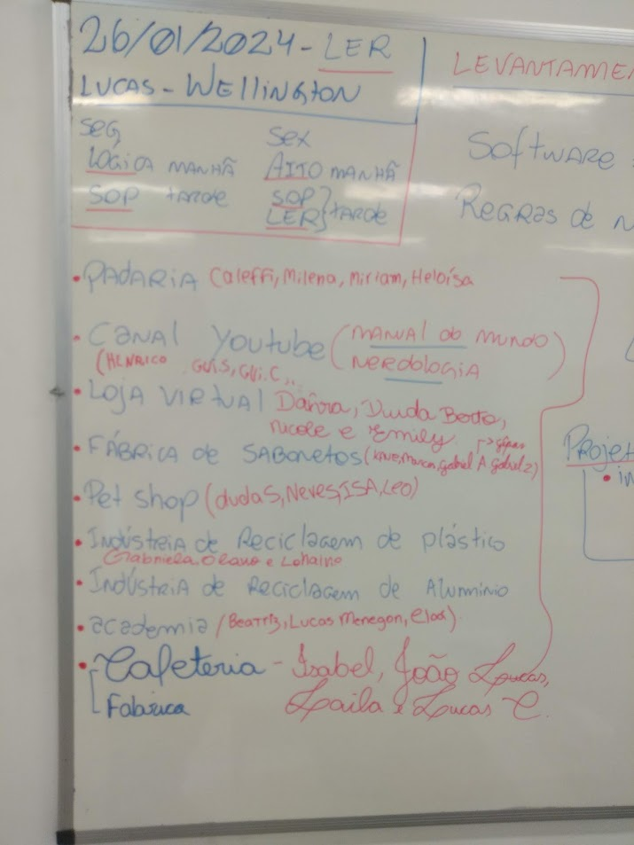

# Aula02

## 2 Levantamento de Requisitos
- 2.1. Definição
- 2.2. Técnicas
    - 2.2.1.Briefing
    - 2.2.2.Levantamento orientado a pontos de vista
    - 2.2.3.Etnografia (observação)
    - 2.2.4.Entrevistas
    - 2.2.5.Brainstorming

### Briefing
É um documento que servirá como um guia para a execução de um projeto. Ele contém uma série de informações como: dados sobre a empresa, o mercado em que ela atua, o público ao qual ela se direciona e os seus objetivos com o projeto.
### Levantamento orientado a pontos de vista
Esta metodologia se baseia na união de levantamento dos processos que irão compor o projeto e o modo como é visto por cada participante do projeto, com ela reconhecemos várias perspectivas e oferece um framework para descobrir os conflitos entre essas diversas visões.
### Etnografia (observação)
Ir até o local onde o sistema será implantado e observar todo o processo de trabalho, conversar com os stack holders e obter informações pertinentes sobre o negócio.
### Entrevistas
Questionário, presencial ou online com questões sobre as necessidades do cliente.
### Brainstorming
Tempestade de ideias, uma reunião curta com os envolvidos no desenvolvimento do sistema levantando as principais ideias de solução para os problemas do cliente.

# Regras de negócio.
Escolher um tema e pesquisar utilizando uma das técnicas acima levantando as informações sobre o negócio do cliente.

