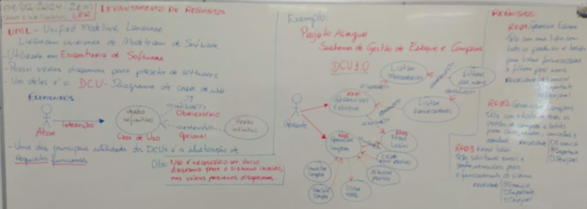
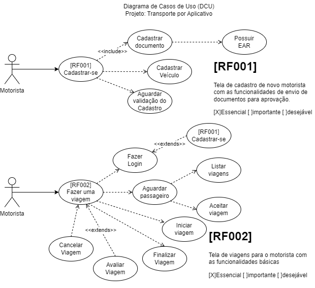

# Aula 03 - Requisitos e UML (Unified Modeling Language)

## 2 Levantamento de Requisitos
	- 2.3. Fases
		- 2.3.1.Coleta
		- 2.3.2.Análise
		- 2.3.3.Registros
## 3 Gerenciamento de Requisitos
	- 3.1. Definição

### Requisitos funcionais:
- Nós programadores trabalhamos boa parte do tempo codificando funcionalidades (requisitos funcionais)
- Uma forma de ilustrar é utilizando UML - DCU.
- 
- 
- 

## Atividade 01
### Contextualização:
A empresa XPT é uma loja de Pneus que além de vender, faz serviços, como troca, montagem, alinhamento, entre outros, não possui um sistema de estoque.
### Desafio:
A partir dos requisitos descritos a seguir, criar os diagramas de casos de uso para cada requisito do sistema de estoque.
- RF01: Tela de cadastro de fornecedores, com uma lista dos fornecedores cadastrados, um formulário para cadastrar novos fornecedores.
- RF02: Tela de cadastro de produtos, com uma lista dos produtos cadastrados e um formulário para inserir novos produtos
- RF03: Tela de cadastro de compras, com um formulário onde o comprador escolhe o fornecedor,  os produtos, preços e quantidades.
- RF04: Tela de retirada de produtos, onde os vendedores registram as quantidades vendidas de cada produto.

## 4 Documentação de Requisitos
- 4.1. Normas técnicas
- 4.2. Estrutura padrão (modelos de documentação)
- 4.3. Controle de Versões

### Exemplo de trabalho para entrega (Solução do desafio)
- [Trabalho Pneus versão Word](./Projeto_XPTO_Pneus.docx)
- [Trabalho Pneus versão de entrega PDF](./Projeto_XPTO_Pneus.pdf)

## Atividade 02
### Desafio para entrega 01/03
Concluído o trabalho sobre **RN (Regras de negócio)** agora defina um sistema como solução para o tema escolhido e documente cada funcionalidade (Requisito Funcional) utilizando a sigla RF001, RF002 ... e DCUs (diagramas de casos de uso).

### Entrega
[Formulário para anexar PDF](https://forms.gle/tbKgCS9mVWqmT73y7)