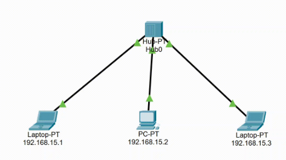

# Aula05
## Simulação de redes com Packet tracer
Packet tracer é um simulador de redes desenvolvido pela empresa **CISCO** disponível gratuitamente para pessoas cadastradas na **Cisco Net Academy**

# Simulação de rede

Na imagem acima temos um HUB conectado a três End-points (dois Laptops e um PC), e uma rede lógica com IPv4 classe C configurado.

## Desafio
Crie uma simulação utilizando um HUB e 5 PCs configurados com uma rede IPv4 classe A 10.0.0.0/8.
- Faça teste com ping em tempo real
- Envie um pacote de um PC a outro PC e faça uma simulação
- Envie outro pacote simultâneo de outro PC para outro e observe a colizão dos pacotes
- Adicione a sua rede um roteador e um servidor configurado com um ip público/externo IP 200.200.200.5/24 ligado ao roteador (Como se fosse Internet)
- Configure o roteador para conectar as duas redes 10.0.0.0/8 para 200.200.200.0 e 200.200.200.0/24 para 10.0.0.0

## Atividades
Fizemos o cadastro no curso de IoT da Ciscon Net Academy agora faremos este curso introdutório e teremos como missão concluir todos os 7 questionários até o **final deste mês**.