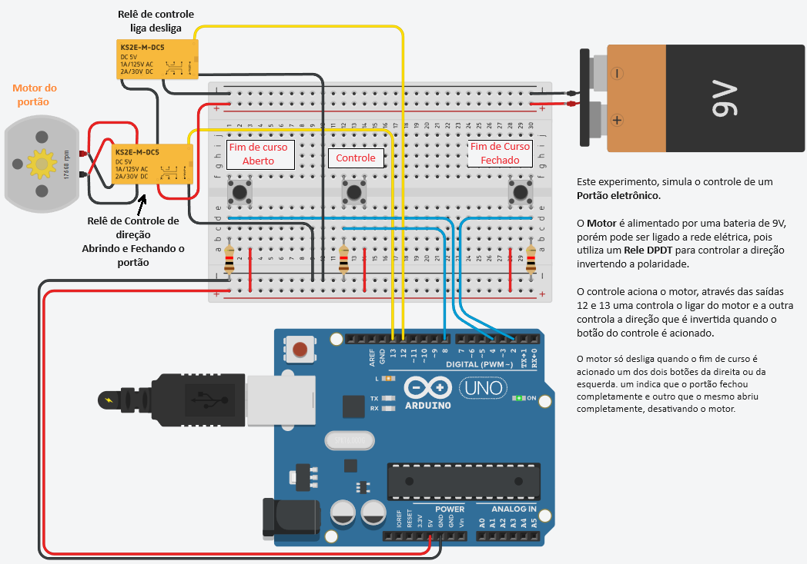
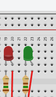
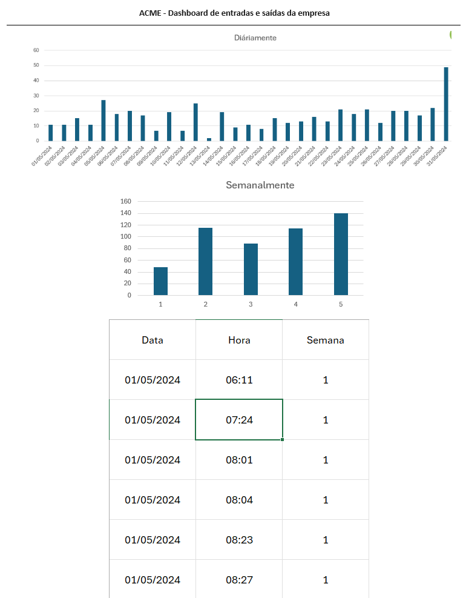

# Aula13 - VPS02
Verificação Prática Somativa 02

## Situação Problema

|Contextualização|
|-|
|Você faz parde de uma equipe de automação industrial onde aplica seus conhecimentos de redes e Iot com o objetivo de aumentar a segurança, eficiência e inovação de seus clientes, a indústria que vocês estão atendendo precisa de um portão eletrônico que será conectado a internet gerando um relatório de quantas vezes foi acionado durante o dia, mês, ano, ... |

|Desafios|
|-|
|1 - O experimento a seguir tem o objetivo de controlar este portão, você precisa replicá-lo otilizando os componentes a seguir: Placa de ensaio pequena, Arduino UNO R3, Bateria de 9V, Motor CC, 2 Relês DPDT, 3 Botões e 3 Resistores 1kohm.|
||
|Obs: O código de que controla o acionamento do portão está no arquivo **arduino.c**|
|2 - Acrescente nesta simulação dois leds um vermelho e um verde que deverão ficar piscando alternadamente para sinalizar a saida de garagem da empresa: |
|3 - O arquivo **dados.csv** possui uma tabela com dados que representam o histórico de quantas vezes o portão foi aberto durante o mês de maio de 2024, abra este arquivo no Excel e crie dois gráficos, um que mostre a atividade do portão diáriamente e um semanalmente. Os gráficos devem ficar semelhantes aos seguintes, porém com valores diferentes, pois são apenas exemplos|
|4 - Tire **print** dos gráficos e crie uma página web conforme o wireframe a seguir|
|

|

|Entregas|
|-|
|Repositório público do **github** com o nome **vps02iot** com duas pastas e um arquivo README.md como capa  - 1 a primeira pasta chamada **portao** com o arquivo **codigo.c** com o código fonte e um **print.png** com a imagem do seu projeto do Thinkercad  - 2 A segunda chamada **site** contendo o arquivo index.html, style.css com a página/dashboard de controle dos acessos ao portão.|
|**[Form para entrega](https://docs.google.com/forms/d/e/1FAIpQLScRVFmGb3YJ2i78CUaj6Dej_fQRqqT9EXrSdrzTTEMSHOUK-Q/viewform?usp=sf_link)**|

## Critérios
|Criticidade|Capacidades Básicas e Socioemocionais|Critérios|
|-|-|-|
||Utilizar ativos e passivos que compõem uma rede de computadores|Realizou experimentos no simulador, utilizando notebook, wifi, conexão com internet, repositório online|
||Aplicar arquitetura de hardware em IoT|Executou experimento no simulador utilizando sensores e/ou atuadores com eficácia na resolução de ao menos um dos experimentos|
||Configurar os tipos de serviços fundamentais de redes|Utilizou o repositório em nuvem "github" para armazenar e entregar os códigos desenvolvidos|
||Demonstrar autogestão|Seguiu as orientações dos professores quanto ao tempo de avaliação e entrega|
||Demonstrar pensamento analítico|Entendeu como o tema estudado está relacionado aos outros temas|
||Demonstrar inteligência emocional|Não permitiu que fatores externos influênciase criticamente seu desempenho|
||Demonstrar autonomia|Codificou solução na linguagem de programação do microcontrolador Arduino UNO através do simulador|