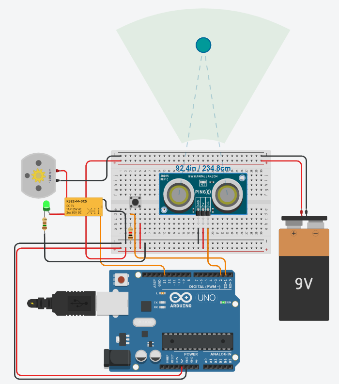
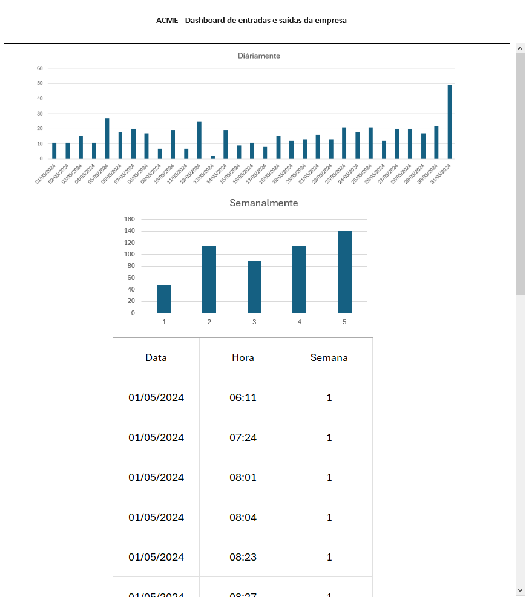

# Aula14 - VPS02 - Recuperação

## Situação Problema

|Contextualização|
|-|
|Você faz parde de uma equipe de automação industrial onde aplica seus conhecimentos de redes e Iot com o objetivo de aumentar a segurança, eficiência e inovação de seus clientes, a indústria que vocês estão atendendo precisa de uma esteira para transportar produtos, a esteira possui um botão para ligar e desligar e um sensor de proximidade, caso um funcionário chegue a menos de 50 cm da esteira a mesma deve se desligar.|

|Desafios|
|-|
|1 - Monte o experimento a seguir que demosntra o funcionamento da esteira, utilizando os componentes a seguir: Placa de ensaio pequena, Arduino UNO R3, Bateria de 9V, Motor CC, 1 Relês DPDT, 1 Botão, 1 Resistores 1kohm. e um sensor de proximidade ultrasonico PING|
||
|2 - O código abaixo é a base para o controle do motor e do sensor de proximidade, acrescente as funcionalidades do botão para ligar e desligar o motor e a segurança que desliga a esteira caso se aproxime a menos de 50cm.|

```c
#define ESTEIRA 13
#define BOTAO 1
#define SENSOR 2
bool status = false;

void setup()
{
  pinMode(ESTEIRA, OUTPUT);
  pinMode(BOTAO, INPUT);
  Serial.begin(9600);
}

long microsecondsToCentimeters(long microseconds) {
  // A fórmula para converter a duração em distância é:
  // distância = (duração x velocidade do som) / 2
  // onde a velocidade do som é de aproximadamente 340 metros por segundo
  // e a duração é em microsegundos
  return microseconds / 29 / 2;
}

long distancia(){
  long duration, distance;
  pinMode(SENSOR, OUTPUT); // Configura o pino como saída
  digitalWrite(SENSOR, LOW); // Envio um pulso baixo para o sensor
  delayMicroseconds(2); // Aguarda 2 microsegundos
  digitalWrite(SENSOR, HIGH); // Envio um pulso alto para o sensor
  delayMicroseconds(5); // Aguarda 5 microsegundos
  digitalWrite(SENSOR, LOW); // Envio um pulso baixo novamente para o sensor
  pinMode(SENSOR, INPUT); // Configura o pino como entrada
  duration = pulseIn(SENSOR, HIGH); // Mede a duração do pulso de eco
  distance = microsecondsToCentimeters(duration); // Converte a duração para distância em centímetros
  return distance;
}

void loop()
{ 

}
```

|Parte 2|
|-|
|Os dados a seguir estão em uma tabela que representam o histórico de quantas vezes a esteira foi interrompida durante o mês de maio de 2024, abra este arquivo no Excel e crie dois gráficos, um que mostre a atividade do portão diáriamente e um semanalmente. Os gráficos devem ficar semelhantes aos do wireframe, porém os valores são um pouco diferentes, pois a imagem é apens um esboço|
|4 - Tire **print** dos gráficos e crie uma página web conforme o wireframe a seguir, a tabela deve ser em HTML utilizando pelo menos os dados da primeira semana.|

```dados.csv
Data;Hora;Semana
01/05/2024;06:11;1
01/05/2024;07:24;1
01/05/2024;08:01;1
01/05/2024;08:04;1
01/05/2024;08:23;1
01/05/2024;08:27;1
01/05/2024;08:28;1
01/05/2024;08:37;1
01/05/2024;09:08;1
01/05/2024;10:42;1
01/05/2024;11:39;1
02/05/2024;09:04;1
02/05/2024;09:05;1
02/05/2024;09:37;1
02/05/2024;09:38;1
02/05/2024;09:46;1
02/05/2024;09:48;1
02/05/2024;11:59;1
02/05/2024;12:44;1
02/05/2024;12:49;1
02/05/2024;13:24;1
02/05/2024;13:45;1
02/05/2024;14:32;1
02/05/2024;14:33;1
02/05/2024;15:15;1
02/05/2024;15:24;1
02/05/2024;15:48;1
02/05/2024;15:56;1
03/05/2024;13:33;1
03/05/2024;13:42;1
03/05/2024;13:44;1
03/05/2024;14:16;1
03/05/2024;14:25;1
03/05/2024;14:27;1
03/05/2024;14:53;1
03/05/2024;15:14;1
03/05/2024;15:50;1
03/05/2024;16:05;1
03/05/2024;17:12;1
03/05/2024;17:39;1
03/05/2024;17:58;1
04/05/2024;06:01;1
04/05/2024;06:40;1
04/05/2024;07:36;1
04/05/2024;08:25;1
04/05/2024;09:17;1
04/05/2024;09:40;1
04/05/2024;09:47;1
04/05/2024;10:27;1
04/05/2024;10:35;1
04/05/2024;10:50;1
05/05/2024;06:05;2
05/05/2024;12:33;2
05/05/2024;13:15;2
05/05/2024;13:30;2
05/05/2024;13:56;2
05/05/2024;14:13;2
05/05/2024;14:36;2
06/05/2024;07:49;2
07/05/2024;08:33;2
07/05/2024;09:36;2
07/05/2024;10:30;2
07/05/2024;10:38;2
07/05/2024;17:37;2
07/05/2024;17:50;2
07/05/2024;17:54;2
07/05/2024;18:01;2
08/05/2024;06:03;2
08/05/2024;06:26;2
08/05/2024;07:01;2
08/05/2024;07:22;2
08/05/2024;07:59;2
08/05/2024;08:08;2
08/05/2024;08:44;2
08/05/2024;09:02;2
08/05/2024;15:04;2
12/05/2024;15:08;3
12/05/2024;15:46;3
12/05/2024;15:57;3
12/05/2024;16:38;3
12/05/2024;16:53;3
12/05/2024;17:16;3
12/05/2024;17:17;3
12/05/2024;17:44;3
13/05/2024;07:45;3
13/05/2024;07:53;3
13/05/2024;08:07;3
13/05/2024;08:12;3
13/05/2024;08:15;3
13/05/2024;09:41;3
13/05/2024;10:53;3
13/05/2024;12:32;3
14/05/2024;17:36;3
15/05/2024;07:11;3
15/05/2024;08:21;3
15/05/2024;08:36;3
15/05/2024;09:55;3
15/05/2024;10:06;3
19/05/2024;07:55;4
19/05/2024;09:24;4
20/05/2024;14:50;4
20/05/2024;16:10;4
20/05/2024;16:28;4
22/05/2024;12:16;4
22/05/2024;12:43;4
22/05/2024;12:51;4
22/05/2024;13:01;4
23/05/2024;10:15;4
23/05/2024;10:23;4
23/05/2024;12:17;4
23/05/2024;12:35;4
23/05/2024;13:13;4
23/05/2024;14:34;4
23/05/2024;15:45;4
23/05/2024;15:52;4
23/05/2024;15:59;4
25/05/2024;11:52;4
25/05/2024;12:22;4
25/05/2024;12:26;4
25/05/2024;13:21;4
25/05/2024;14:17;4
25/05/2024;14:49;4
25/05/2024;14:59;4
25/05/2024;15:01;4
25/05/2024;15:07;4
25/05/2024;15:23;4
25/05/2024;15:43;4
25/05/2024;16:00;4
25/05/2024;16:17;4
25/05/2024;17:56;4
26/05/2024;06:19;5
26/05/2024;07:05;5
26/05/2024;08:22;5
31/05/2024;16:03;5
31/05/2024;16:20;5
31/05/2024;16:31;5
31/05/2024;16:46;5
31/05/2024;16:52;5
31/05/2024;16:54;5
31/05/2024;17:11;5
31/05/2024;17:19;5
31/05/2024;17:23;5
```

|Wireframe|
|:-:|
||

|Entregas|
|-|
|Repositório público do **github** com o nome **vps02iot** com duas pastas e um arquivo README.md como capa<br> - 1 a primeira pasta chamada **esteira** com o arquivo **codigo.c** com o código fonte e um ou mais **prints.png** com a imagem do seu projeto do Thinkercad<br> - 2 A segunda chamada **site** contendo o arquivo index.html, style.css com a página/dashboard de controle dos acessos ao portão.|
|**[Form para entrega](https://docs.google.com/forms/d/e/1FAIpQLScRVFmGb3YJ2i78CUaj6Dej_fQRqqT9EXrSdrzTTEMSHOUK-Q/viewform?usp=sf_link)**|

## Critérios
|Criticidade|Capacidades Básicas e Socioemocionais|Critérios|
|-|-|-|
||Utilizar ativos e passivos que compõem uma rede de computadores|Realizou experimentos no simulador, utilizando notebook, wifi, conexão com internet, repositório online|
||Aplicar arquitetura de hardware em IoT|Executou experimento no simulador utilizando sensores e/ou atuadores com eficácia na resolução de ao menos um dos experimentos|
||Configurar os tipos de serviços fundamentais de redes|Utilizou o repositório em nuvem "github" para armazenar e entregar os códigos desenvolvidos|
||Demonstrar autogestão|Seguiu as orientações dos professores quanto ao tempo de avaliação e entrega|
||Demonstrar pensamento analítico|Entendeu como o tema estudado está relacionado aos outros temas: Ex o codigo implementado foi eficaz sem comprometer o funcionamento do restante|
||Demonstrar inteligência emocional|Não permitiu que fatores externos influênciase criticamente seu desempenho|
||Demonstrar autonomia|Codificou solução na linguagem de programação do microcontrolador Arduino UNO através do simulador|