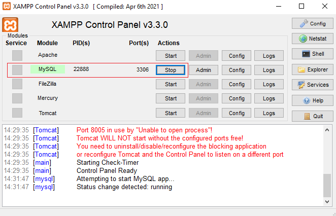
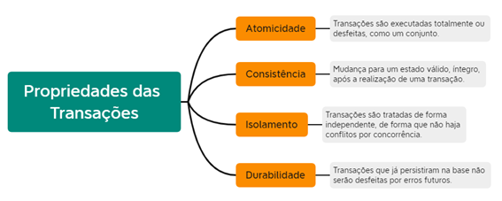

# Tipos de bancos de dados
- Não estruturado
  - TXT
  - DOC
  - PDF
  - XLS (Excel)
- Semi-estruturado
  - XML
  - JSON
- Estruturado
	- SGBD (Sistema Gerenciador de Banco de Dados)
	- Sem SGBD = CSV
	- Com SGBD
		- Não SQL (Ex: MongoDB, FireBase ...)
			- Não Relacional
		- SQL (Ex: Mysql, Oracle, SQL Server, Postgres, FireBird ...)
			- Relacionais
## Abiente de desenvolvimento
- XAMPP
- VSCode
- Git
- MySQL Workbanck

## Tutorial para acessar o SGBD (Sistema Gerenciador de Banco de Dados) MySQL/MariaDB pela primeira vez.
- 1 Instalar o XAMPP
- 2 Abrir o XAMPP Control Panel
  - Iniciar e digite XAMPP no menu iniciar ou navegue até
  ```cmd
  c:\xampp\xampp-control.exe
  ```
  Clique em **start** no serviço **Mysql**
  
- 3 Abra uma **pasta** com o **VsCode** crie um arquivo de **script.sql**
- 4 Abra um terminal e configure como **cmd** ou **git**
- 5 Saia de todas as pastas e acessa a pasta **c:\xampp\mysql\bin**
```cmd
c:\aula\>cd\
c:\>cd xampp
c:\xampp>cd mysql
c:\xampp\mysql>cd bin
c:\xampp\mysql\bin>mysql -u root
```
- 6 Pronto você está pronto para executar comandos e scripts **SQL**


## Scripts SQL

- DDL - Dinamic Development Language

```sql
-- Criar um banco de dados
create database lojinha;

-- Listar todos os bancos de dados
show databases;

-- Acessar o banco de dados
use lojinha;

-- Excluir um banco de dados
drop database lojinha;
```

- Tabela

```sql
-- DDL - Dinamic Data Language
-- Criar um banco de dados
drop database if exists escola;
create database escola;
use escola;

-- Criar uma tabela de Alunos
create table Alunos(
    id int not null primary key auto_increment,
    nome varchar(100) not null,
    telefone varchar(20),
    email varchar(100) not null
);

-- Listar as tabelas
show tables;
-- Ver a estrutura da tabela
describe Alunos;

-- Excluir uma tabela
-- drop table Alunos;

-- Alterar uma tabela, acrescentar um campo/culuna
alter table Alunos add column idade int;

-- Ver a estrutura da tabela
describe Alunos;

-- Alterar a tabela, remover o campo idade
alter table Alunos drop column idade;

-- Ver a estrutura da tabela
describe Alunos;

-- DML - Data Manipulation Language
-- CRUD - Create, Read, Update, Delete
-- Create - Criar os dados dos alunos inserindo na tabela
insert into Alunos values (1,"João","19 99878-7879","joao@gamil.com");
insert into Alunos values (2,"Mariana","19 95978-7879","mariana@gmail.com");
insert into Alunos values (3,"Carlos","19 91878-7879","carlos@gmail.com");
insert into Alunos values (4,"Ana","19 99875-7179","ana@gmail.com");
insert into Alunos values (5,"Pedro","19 99878-7759","pedro@gamil.com");
insert into Alunos values (6,"Paula","19 99878-7619","paula@gmail.com");
insert into Alunos values (7,"Lucas","19 99878-7880","lucas@gmail.com");
insert into Alunos values (8,"Julia","19 99878-5555","julia@gmail.com");
insert into Alunos values (9,"Marcos","19 99878-7777","marcos@gmail.com");
insert into Alunos values (10,"Maria","19 99878-8888","maria@gmail.com");

-- Read - Listar os alunos 
select * from Alunos;

-- Update - Atualizar os dados de um aluno
update Alunos set nome = "Ana Luiza" where id = 1;
update Alunos set email = "analuiza@gmail.com" where id = 1;
select * from Alunos;

-- Delete - Excluir um aluno
delete from Alunos where id = 1;
select * from Alunos;
```

## Chave
	- Campo único que identifica o registro (A linha inteira de dados)
	- Chave Primária (Não se repete na tabela)
	- Chave Estrangeira (Se repete na tabela e sempre faz referência a uma chave primária em outra tabela)

## ACID
Estas são as quatro principais características de um banco de dados relacional/transacional
