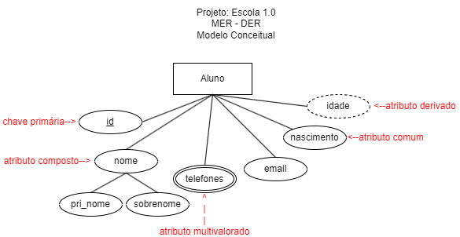
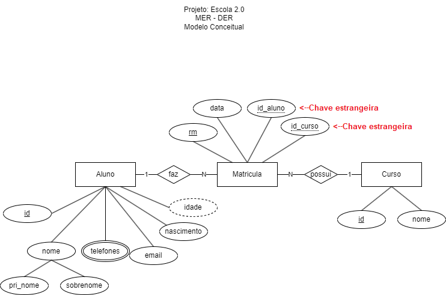
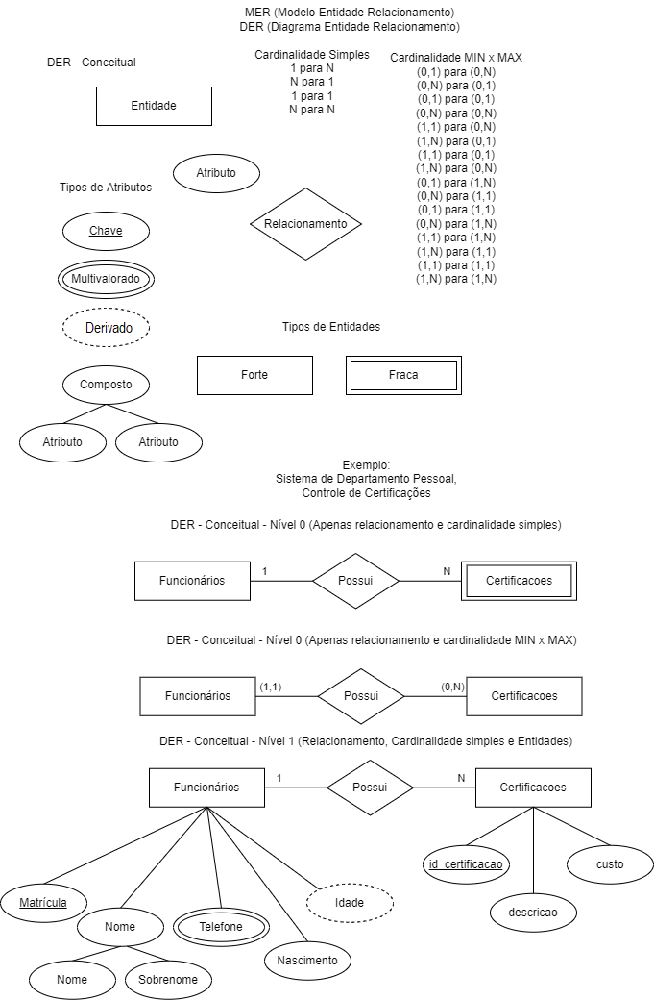

# Aula02 - MER x DER e Dicionário de Dados

- MER - Modelo Entidade Relacionamento
- DER - Diagrama Entidade Relacionamento
- Dicionário de Dados

## MER - Modelo Entidade Relacionamento
O modelo entidade relacionamento é uma forma de representar um banco de dados de forma visual. O modelo é composto por entidades, atributos e relacionamentos.

### Entidades
Entidades são objetos do mundo real que possuem atributos. Exemplo: Aluno, Professor, Disciplina, Curso, etc.

### Atributos
Atributos são características das entidades. Exemplo: Aluno possui os atributos nome, telefone, email, etc.

### Relacionamentos
Relacionamentos são as ligações entre as entidades. Exemplo: Aluno está matriculado em um Curso.

## Níveis
- Conceitual - Mais abstrato, próximo ao problema
- Lógico - Mais detalhado, próximo a solução
- Físico - Detalhes de implementação (SQL)

## DER - Diagrama Entidade Relacionamento
O DER é uma representação gráfica do MER. O DER é composto por entidades, atributos e relacionamentos.
### Exemplo de DER - Escola 1.0

### Exemplo do DER - Escola 2.0

### Notação

## Dicionário de Dados
O dicionário de dados é uma lista de todos os elementos do banco de dados. O dicionário de dados é composto por:

### Exemplo de Dicionário de Dados - Escola
| Entidade | Atributo | Tipo | Tamanho | Descrição |
|----------|----------|------|---------|-----------|
| Aluno    | id       | Int  |         | Identificador do Aluno |
| Aluno    | nome     | Varchar | 100   | Nome do Aluno |
| Aluno    | email    | Varchar | 100   | Email do Aluno |
| Curso    | id       | Int  |         | Identificador do Curso |
| Curso    | nome     | Varchar | 100   | Nome do Curso |
| Matricula| id       | Int  |         | Identificador da Matrícula |
| Matricula| id_aluno | Int  |         | Identificador do Aluno |
| Matricula| id_curso | Int  |         | Identificador do Curso |
| Matricula| data     | Date |         | Data da Matrícula |

