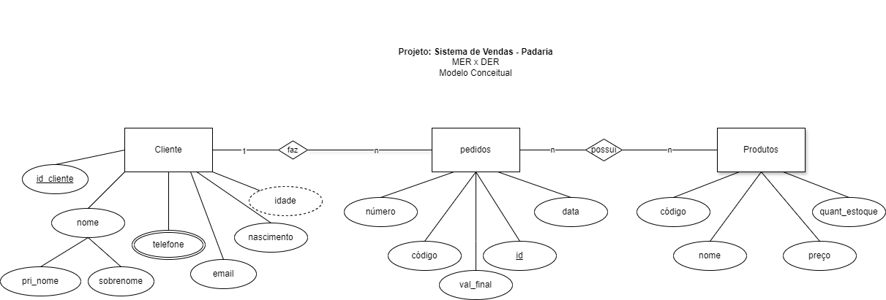
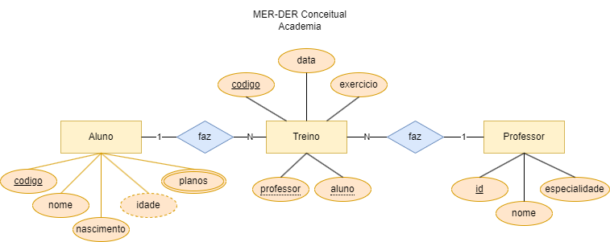
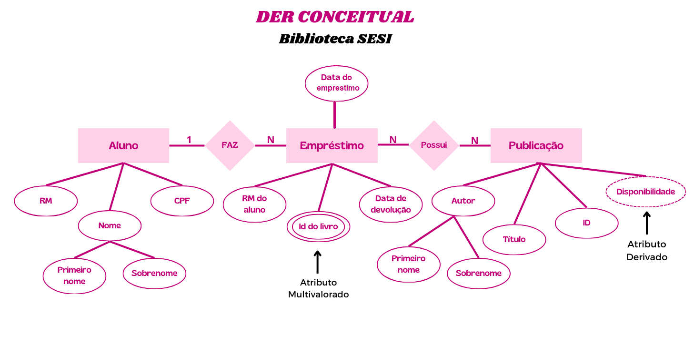
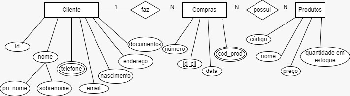
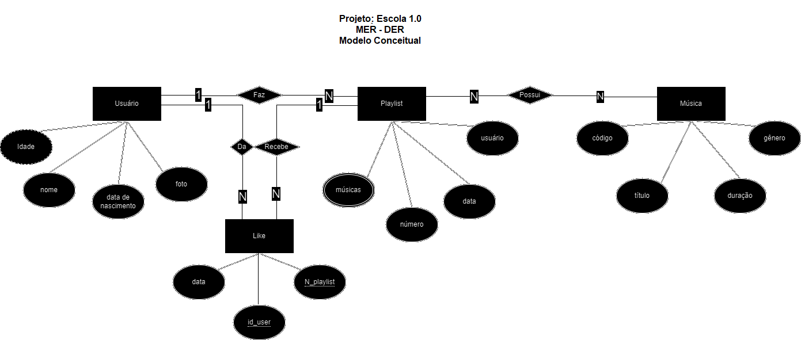

# Aula03 - Correção atividades DER e DD da aula passada
- MER - Modelo Entidade Relacionamento
- MER - DER - Diagrama Entidade Relacionamento
- DER - DD - Dicionário de Dados

## Problemas

### Problema 1 - Padaria (lohaine e Gabriela)
#### https://github.com/LohaineMattos/der-dd
Uma padaria deseja informatizar o seu sistema de vendas. A padaria vende pães, bolos, doces, salgados, etc. Cada produto possui um código, nome, preço e quantidade em estoque. A padaria possui clientes que fazem pedidos. Cada pedido possui um número, data, cliente e produtos.

#### Dicionário de Dados
|Entidade|Atributo|Tipo|Tamanho|Descrição|
|-|-|-|-|-|
|Cliente|id_cliente|Int||Identificador do Cliente|
|Cliente|nome|Varchar|100|Nome do Cliente|
|Cliente|telefone|Varchar|11|Telefone do Cliente|
|Cliente|email|Varchar|100|Email do Cliente|
|Cliente|nascimento|Date||Nascimento do Cliente|
|Cliente|idade|Varchar|100|Idade do Cliente|
|Pedidos|número|Int||Identificador do Pedido|
|Pedidos|código|Int||Protocólo do Pedido|
|Pedidos|val_final|Float||Valor Final do Pedido|
|Pedidos|id|Int||Identificador do Pedido|
|Pedidos|data|Date||Data do Pedido|
|Produtos|código|Int||Protocólo do Produto|
|Produtos|nome|Varchar|100|Nome do Produto|
|Produtos|preço|Float||Preço do Produto|
|Produtos|quant_estoque|Int||Quantidade de Produto no Estoque|
### Problema 2 - Oficina Mecânica (Zanon, Marcos, Araújo, Giachetto)
#### https://github.com/GabrielBZanon/MER---DER.git
Uma oficina mecânica deseja informatizar o seu sistema de ordem de serviço. A oficina atende carros, motos, caminhões, etc. Cada veículo possui uma placa, modelo, ano e cliente. A oficina possui mecânicos que fazem serviços. Cada serviço possui um número, data, veículo e peças.

#### Dicionário de Dados
|Entidade|Atributo|Tipo|Tamanho|Descrição|
|-|-|-|-|-|
|**Funcionário**|id|int||Identificador do funcionário|
|**Funcionário**|nome|varchar|100|Nome do funcionário|
|**Funcionário**|especialidade|varchar|100|Serviço do funcionário|
|**Serviços**|número|int||Número do serviço|
|**Serviços**|Descrição|varchar|100|serviços prestados|
|**Serviços**|preço|float||Preço do serviço|
|**Veículo**|Placa|int||número da placa do veículo|
|**Veículo**|Tipo|varchar|100|classificação do veículo|
|**Veículo**|Modelo|varchar|100|marca do veículo|

### Problema 3 - Academia (Dahra, Duda, Pedro, Nicole e Emily)
Uma academia deseja informatizar o seu sistema de treino. A academia possui alunos que fazem treinos. Cada aluno possui um código, nome, idade e plano. A academia possui professores que fazem treinos. Cada treino possui um número, data, aluno e exercícios.

#### Dicionário de Dados
|Entidade|Atributo|Tipo|Tamanho|Descrição|
|-|-|-|-|-|
|Aluno|codigo|int||Identificador do aluno|
|Aluno|nome|varchar|100|Nome do aluno|
|Aluno|idade|int||Idade do aluno|
|Aluno|nascimento|date||Data de nascimento do aluno|
|Aluno|planos|multivalorado||Planos de treino|
|Treino|numero|int||Número do treino|
|Treino|data|date||Data do treino|
|Treino|aluno|int||Identificador do aluno|
|Treino|professor|int||Identificador do aluno|
|Treino|exercicios|multivalorado||Exercícios do treino|
|Professor|id|int||Identificador do professor|
|Professor|nome|varchar|100|Nome do professor|
|Professor|especialidade|varchar|100|Especialidade do professor|

### Problema 4 - Biblioteca do SESI (Maria, Míriam, Heloísa)Ok (Eloá e Menegon)
#### https://github.com/mariapcaleffi/der-dd
O bibliotecário deseja informatizar o seu sistema de empréstimo. A biblioteca possui livros, revistas, jornais, etc. Cada item possui um código, título, autor e quantidade em estoque. A biblioteca possui sócios que fazem empréstimos. Cada empréstimo possui um número, data, sócio e itens.

#### Dicionário de Dados
|Entidade|Atributo|Tipo|Tamanho|Descrição|
|-|-|-|-|-|
|Aluno|RM|int|100|Identificador do aluno|
|Aluno|nome|varchar||Nome completo do aluno|
|Aluno|CPF|int|100|Identificador do aluno|
|Emprestimo|RM_aluno|int|100|Identificador do aluno|
|Emprestimo|ID_livro|int|100|Identificador da publicação emprestada|
|Emprestimo|data_emprestimo|Date||Data do empréstimo|
|Emprestimo|data_devolucao|Date||Data de devolução do empréstimo|
|Publicação|ID|int|100|Identificador da publicação|
|Publicação|título|varchar||Nome da publicação|
|Publicação|autor|varchar||Nome do autor da publicação|
|Publicação|disponibilidade|int|100|Disponibilidade das publicações no acervo|

### Problema 5 - Mercadinho do Seu João - Fiado (Matheus, Isabelle)
#### https://github.com/Matheus-SNeves/der-dd.git
O dono de um mercadinho deseja informatizar o seu sistema de vendas fiado. O mercadinho vende arroz, feijão, macarrão, etc. Cada produto possui um código, nome, preço e quantidade em estoque. O mercadinho possui clientes que fazem compras. Cada compra possui um número, data, cliente e produtos.

#### Dicionário de Dados
| Entidade | Atributo | Tipo | Tamanho | Descrição |
|-|-|-|-|-|
| Cliente | Nome | Varchar | 100 | Nome do cliente |
| Cliente | Data de nascimento | Int | 3 | Data de nascimento do cliente |
| Cliente | Telefones |Multivalorado|| Telefone do cliente | 
| Cliente | E-mail | Int | 100 | E-mail do cliente |
| Cliente | Endereço | Varchar | 100 | Endereço do cliente | 
| Cliente | id | Int | | Identificador do cliente |
| Cliente | Documentos | Int |  | Documentos do cliente |
| Compra | Número | Int | | Número da compra |
| Compra | Cliente | Varchar | 100 | Compra do cliente |
| Compra | Data | int | 8 | Data da compra |
| Compra | produtos | Multivalorado | | Produto da compra |
| Produto | Quantidade em estoque | int | | Quantidade do produto em estoque |
| Produto | Código | int | | Código do produto |
| Produto | Preço | float | | Preço do produto |
| Produto | Nome | Varchar | 100 | Nome do produto |

### Problema 6 - Rede Social de Música (Laila, Bia e Milena)
#### https://github.com/LailaCM/Rede-Social-Musical.git
O dono de uma rede social de música deseja informatizar o seu sistema de playlists. A rede social possui músicas, álbuns, artistas, etc. Cada música possui um código, título, duração e gênero. A rede social possui usuários que fazem playlists. Cada playlist possui um número, data, usuário e músicas.

#### Dicionário de Dados
| Entidade| Atributo|Tipo|Tamanho|Descrição|                                                   
|-|-|-|-|-|
| **Usuário**| Nome | Varchar | 100 | Identificação do usuário|
| **Usuário** | Idade | Int |  | Observações sobre o usuário    |                                    
| **Usuário** | Foto |Varchar|255| Identificação do usuário|
|**Usuário** |Data de Nascimento | Date | | Identificação do usuário|
| **Playlist**  | Número ||| Identificador único da playlist|
| **Playlist**| Usuário|Varchar|100| Quem criou a playlist|
| **Playlist**| Data | Date||Quando foi criada|
| **Playlist**| Músicas |Varchar|100| Quais estão presentes na playlist|
| **Música** | Código |Int|| Identificador da playlist|
| **Música** | Título |Varchar|100| Nome da música|
| **Música**| Duração |Int|| Duração da música|
| **Like** | Data | Date || Quando foi deixado o like|
| **Like**| Número da Playlist|Int|| Identificação da playlist|
| **Like**|Id_user| Int||Identificação do usuário|

### Problema 7 - Pet Shop (Duda, Jõao, Olavo)Ok
O dono de um pet shop deseja informatizar o seu sistema de vendas. O pet shop vende ração, brinquedos, remédios, etc. Cada produto possui um código, nome, preço e quantidade em estoque. O pet shop possui clientes que fazem compras. Cada compra possui um número, data, cliente e produtos.

### Problema 8 - Escritório de Engenharia Civil (Hasman, Henrico, Canina, Stafocher, Leonardo)Ok
Um escritório de engenharia deseja informatizar o seu sistema de projetos. O escritório faz projetos de casas, prédios, pontes, etc. Cada projeto possui um código, nome, data e cliente. O escritório possui engenheiros que fazem projetos. Cada projeto possui um número, data, engenheiro e atividades.