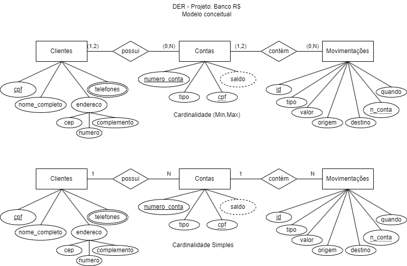

# Aula 04 - Script de Criação e Inserção/População de Dados de teste
## Objetivo
Criar um script de criação de tabelas e inserção/população de dados de teste.

## DER - Diagrama de Entidade e Relacionamento do Banco Digital

## Exemplo
```sql
-- Banco Digital
-- Script de criação do Banco de Dados e tabelas de um BANCO
drop database if exists Banco;
create database Banco character set utf8 collate utf8_general_ci;
use Banco;

create table Cliente(
    cpf varchar(11) not null primary key,
    nome_completo varchar(100) not null,
    endereco_cep varchar(8) not null,
    endereco_numero varchar(10),
    endereco_complemento varchar(100)
);


create table telefone(
    cpf_cliente varchar(11) not null,
    numero_telefone varchar(20) not null,
    tipo varchar(20) not null,
    foreign key(cpf_cliente) references Cliente(cpf)
);

create table conta(
    numero_conta varchar(20) not null primary key,
    cpf_cliente varchar(11) not null,
    tipo varchar(20) not null default('Conta Corrente'),
    saldo decimal(10,2) not null,
    foreign key(cpf_cliente) references Cliente(cpf)
);

create table Movimentacao(
    id int not null primary key auto_increment,
    tipo varchar(20) not null,
    valor float(10,2) not null,
    origem varchar(50) not null,
    destino varchar(50) not null,
    numero_conta varchar(20) not null,
    quando datetime not null default(now()),
    foreign key (numero_conta) references Conta(numero_conta)
);

show tables;

-- Script de População do banco de dados com dados de teste
insert into cliente values
('12345678901','Alberto Aguira Ávila', '13914552', '2925', 'Ap25 Bl13');
insert into telefone values
('12345678901', '19999999999', 'Celular'),
('12345678901', '1933333333', 'Residencial');
insert into conta values
('11111111','12345678901',default,0.00),
('22222222','12345678901','Poupança',0.00);
insert into movimentacao values
(default, 'Depósito', 200.00, 'Caixa eletrônico', 'Conta corrente', '11111111', default),
(default, 'Depósito', 100.00, 'Caixa eletrônico', 'Poupança', '22222222', default),
(default, 'Saque', 50.00, 'Caixa eletrônico', 'Conta corrente', '11111111', default),
(default, 'Transferência Saque', 50.00, 'Conta corrente', 'Poupança', '11111111', default),
(default, 'Transferência Depósito', 50.00, 'Conta corrente', 'Poupança', '22222222', default);
-- Alterando o saldo das contas, após as movimentações
update conta set saldo = 100.00 where numero_conta = '11111111';
update conta set saldo = 150.00 where numero_conta = '22222222';

-- Cadastre mais 3 clientes e pelo menos duas contas para cada cliente e 2 movimentações para cada conta
```