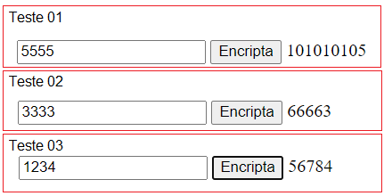
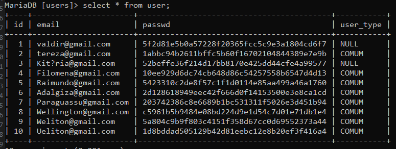

# Aula 05 - Funções Nativas do SGBD
## Objetivo
Apresentar as funções nativas do SGBD que podem ser utilizadas para manipular os dados armazenados no banco de dados.

# Funções de Data MySQL
|Função|Descrição|
|------|---------|
|`NOW()`|Retorna a data e hora atual|
|`CURDATE()`|Retorna a data atual|
|`CURTIME()`|Retorna a hora atual|
|`DATE()`|Extrai a data de um campo datetime|
|`TIME()`|Extrai a hora de um campo datetime|
|`DAY()`|Extrai o dia de um campo datetime|
|`MONTH()`|Extrai o mês de um campo datetime|
|`YEAR()`|Extrai o ano de um campo datetime|
|`HOUR()`|Extrai a hora de um campo datetime|
|`MINUTE()`|Extrai o minuto de um campo datetime|
|`SECOND()`|Extrai o segundo de um campo datetime|
|`DAYNAME()`|Retorna o nome do dia da semana|
|`MONTHNAME()`|Retorna o nome do mês|
|`DAYOFWEEK()`|Retorna o dia da semana|
|`DAYOFMONTH()`|Retorna o dia do mês|
|`DAYOFYEAR()`|Retorna o dia do ano|
|`WEEK()`|Retorna a semana do ano|
|`LAST_DAY()`|Retorna o último dia do mês|
|`DATE_ADD()`|Adiciona um intervalo de tempo a uma data|
|`DATE_SUB()`|Subtrai um intervalo de tempo de uma data|

## Exemplos de DATE_SUB
```sql
SELECT DATE_SUB(NOW(), INTERVAL 1 DAY);
SELECT DATE_SUB(NOW(), INTERVAL 1 MONTH);
SELECT DATE_SUB(NOW(), INTERVAL 1 YEAR);
SELECT DATE_SUB(NOW(), INTERVAL 1 HOUR);
```

## Criptografia e HASH
O objetivo da utilização de funções de criptografia e hash é proteger os dados armazenados no banco de dados. As funções de criptografia e hash são utilizadas para proteger os dados sensíveis armazenados no banco de dados.
<br>
A criptografia embaraça os dados de forma que somente quem possui a chave de descriptografia pode visualizar o conteúdo original. Já o hash é uma função que gera um valor único para um determinado conjunto de dados. O hash é utilizado para verificar a integridade dos dados.

### Criptografia definição
Criptografia é o campo da ciência da computação e da matemática que se ocupa da proteção da informação por meio de técnicas que tornam os dados ilegíveis para pessoas não autorizadas. O objetivo principal da criptografia é garantir a confidencialidade, integridade e autenticidade da informação.


#### Conceitos chaves
- Confidencialidade: Garante que apenas as partes autorizadas possam acessar e entender a informação. Isso é geralmente alcançado através da criptografia, que transforma dados legíveis em uma forma cifrada.
- Integridade: Assegura que a informação não foi alterada de forma não autorizada. Técnicas como assinaturas digitais e códigos de autenticação de mensagem (MAC) ajudam a verificar se os dados foram modificados.
- Autenticidade: Verifica a identidade das partes envolvidas na comunicação, garantindo que a informação provém de uma fonte legítima. Isso pode ser feito através de certificados digitais e sistemas de autenticação.
- Criptografia Simétrica: Utiliza a mesma chave para criptografar e descriptografar a informação. O desafio é garantir que a chave seja mantida em segredo entre as partes envolvidas.
- Criptografia Assimétrica: Utiliza um par de chaves, uma pública e uma privada. A chave pública pode ser compartilhada com todos, enquanto a chave privada é mantida em segredo. A chave pública é usada para criptografar dados, e a chave privada é usada para descriptografá-los.
- Algoritmos de Criptografia: Conjunto de procedimentos matemáticos usados para criptografar e descriptografar dados. Exemplos incluem AES (Advanced Encryption Standard) para criptografia simétrica e RSA (Rivest-Shamir-Adleman) para criptografia assimétrica.
- Hashing: Processo que transforma dados em uma string de comprimento fixo, geralmente para verificar a integridade dos dados. Funções hash, como SHA-256, geram um valor hash único para cada conjunto de dados.
- Criptoanálise: O estudo da quebra de sistemas criptográficos. A criptoanálise busca encontrar fraquezas nos algoritmos e métodos de criptografia.

#### Cifra de Cesar
A cifra de César é uma técnica clássica de criptografia que pertence ao grupo das cifras de substituição. É uma das formas mais simples e antigas de criptografia, nomeada em homenagem a Júlio César, que usava esse método para proteger suas mensagens militares.

#### Como funciona
Substituição de Caracteres: A cifra de César funciona substituindo cada letra do texto original (plaintext) por outra letra que está um número fixo de posições à frente no alfabeto. Por exemplo, se o deslocamento (ou chave) for 3, a letra A se torna D, a letra B se torna E, e assim por diante.
Chave de Criptografia: O número de posições que cada letra deve ser deslocada é conhecido como a chave. No exemplo acima, a chave é 3. Para decifrar a mensagem, você aplicaria o deslocamento inverso.


#### Exemplo
Suponha que queremos criptografar a mensagem "HELLO" com uma chave de 3:
- H se torna K
- E se torna H
- L se torna O
- O se torna R Portanto, "HELLO" criptografado com uma chave de 3 seria "KHOOR".
Decodificação Para decifrar a mensagem, você aplicaria o deslocamento inverso. Se a chave for 3, você deslocaria cada letra para trás no alfabeto por 3 posições:
- K se torna H
- H se torna E
- O se torna L
- R se torna O Então, "KHOOR" se tornaria "HELLO".

#### Segurança
A cifra de César é muito simples e, portanto, é considerada insegura por padrões modernos. Pode ser facilmente quebrada usando ataques de força bruta ou análise de frequência, especialmente porque há apenas 25 possíveis chaves (desconsiderando o deslocamento de 0, que não altera o texto). Apesar disso, a cifra de César é uma ferramenta útil para ensinar os conceitos básicos de criptografia e criptanálise.

#### Conteúdo adicional
[Artigo sobre criptografia](https://pt.khanacademy.org/computing/computer-science/cryptography)
- Filme: O Jogo da Imitação


### MD5
```sql
SELECT MD5('Senha');
```

### SHA1
```sql
SELECT SHA1('Senha');
```

### SHA2
```sql
SELECT SHA2('Senha', 256);
```

### AES_ENCRYPT
```sql
SELECT AES_ENCRYPT('Texto', 'Chave');
```

### AES_DECRYPT
```sql
SELECT AES_DECRYPT('TextoCriptografado', 'Chave');
```

### PASSWORD
```sql
SELECT PASSWORD('Senha');
```

# Dinâmica de criptografia

Separados em grupos de 4 a 5 alunos, desenvolver um sistema de login e senha utilizando matemática simples em folhas de papel.
- O sistema deve ser capaz de armazenar o login e senha do usuário de forma segura no banco de dados.
- O sistema deve ser capaz de verificar se o login e senha informados pelo usuário estão corretos.
- Os integrantes do seu grupo devem ser capazes de acessar o sistema utilizando o login e senha armazenados no banco de dados.
- Os integrantes de outros grupos não devem ser capazes de acessar o sistema utilizando o login e senha armazenados no banco de dados.

## Exemplo de criptografia
- senha: 1234
- chave: o último número da própria senha
- senha criptografada onde cada número é acrescido da chave: 1 + 4, 2 + 4, 3 + 4, 4 + 4 e a chave = **56784**
- senha criptografada: 56784
- **Decriptografia**: 5 - 4, 6 - 4, 7 - 4, 8 - 4 = **1234**

- encripta.html
```html
<!DOCTYPE html>
<html lang="en">
<head>
    <meta charset="UTF-8">
    <meta name="viewport" content="width=device-width, initial-scale=1.0">
    <title>Encripta</title>
</head>
<body>
    <input type="number" id="senha">
    <input type="button" value="Encripta" onclick="encripta(senha.value)">
    <label id="resp"></label>
</body>
<script>
    function encripta(senha){
        senha = senha.split('');
        let ultimo = senha.length - 1;
        let resp = '';
        senha.forEach(c => {
            resp += (parseInt(c) + parseInt(senha[ultimo]));
        });
        resp += senha[ultimo]; 
        document.querySelector("#resp").innerHTML = resp;
    }
</script>
</html>
```
Testando o programa com valores de senha diferentes: 5555, 3333, 1234


## Exemplo de Banco de dados utilizando Funções e Criptografia
```sql
drop database if exists users;
create database users;
use users;
create table user(
    id int not null primary key auto_increment,
    email varchar(255) not null,
    passwd varchar(100) not null,
    user_type varchar(20) default('ADMIN')
);

insert into user(email, passwd, user_type) values
('valdir@gmail.com',sha1('valdir123'),null),
('tereza@gmail.com',sha1('Vfr$5tgb'),'COMUM'),
('Kitéria@gmail.com',sha1('AAsaAtgb'),null),
('Filomena@gmail.com',sha1('Otavio'),'COMUM'),
('Raimundo@gmail.com',sha1('23051980'),'COMUM'),
('Adalgiza@gmail.com',sha1('Facil123'),'COMUM'),
('Paraguassu@gmail.com',sha1('Senhafacil'),'COMUM'),
('Wellington@gmail.com',sha1('Dificil'),'COMUM'),
('Weliton@gmail.com',sha1('mamamama'),'COMUM'),
('Ueliton@gmail.com',sha1('ananana'),'COMUM');

select * from user;
```
- resultado
