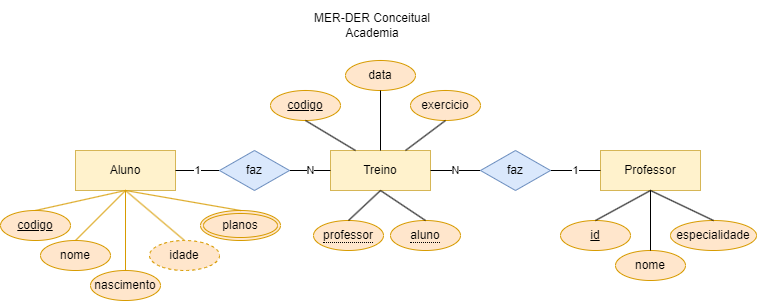
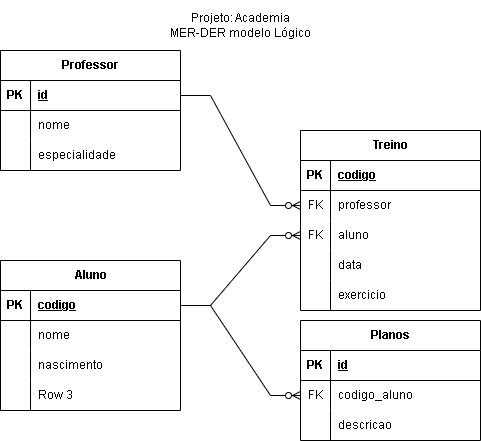

# Aula07 - RESUMO - Fase01

## O que é Banco de Dados?
Banco de dados é uma coleção de dados inter-relacionados, representando informações sobre um domínio específico. Um banco de dados é projetado para oferecer uma visão abstrata dos dados para o usuário, separando a complexidade dos dados do usuário.

## Tipos quanto aos dados
- Relacional
- Não relacional

## Tipos de dados
- Estruturados (SQL, CSV)
- Semi-estruturados (JSON, XML)
- Não estruturados (PDF, DOC)

## Modelo de dados
- MER (Modelo Entidade Relacionamento) Geralmente utilizado para modelar bancos de dados relacionais.

## Formas de modelar os dados
- Diagrama de Entidade Relacionamento (DER): imagem
- Dicionário de Dados: descrição dos dados em texto

## Diagramas
Existem vários tipos de DER, como:
- DER Conceitual<br>O DER Conceitual é um diagrama de alto nível que descreve a estrutura de um banco de dados. Ele é independente do SGBD e é utilizado para representar as entidades e seus relacionamentos. Nível mais próximo do usuário.
- DER Lógico<br>O DER Lógico é um diagrama que descreve a estrutura de um banco de dados em um nível mais detalhado. Ele é independente do SGBD e é utilizado para representar as entidades, seus relacionamentos e atributos. Nível mais próximo do SGBD.
- DER Físico **SQL - DDL (Definição de Dados)**:
```sql
create database Academia character set utf8 collate utf8_general_ci;
use Academia;

create table Aluno(
    codigo int not null primary key auto_increment,
    nome varchar(100) not null,
    nascimento date not null,
);

create table Planos(
    id int not null primary key auto_increment,
    codigo_aluno int not null,
    foreign key (codigo_aluno) references Aluno(codigo)
);

create table Professor(
    id int not null primary key auto_increment,
    nome varchar(100) not null,
    especialidade varchar(100) not null
);

create table Treino(
    codigo not null primary key auto_increment,
    professor int not null,
    aluno int not null,
    data date not null,
    exercicio varchar(100) not null,
    foreign key (professor) references Professor(id),
    foreign key (aluno) references Aluno(codigo)
);
```
<br>O DER Físico é um diagrama que descreve a estrutura de um banco de dados em um nível ainda mais detalhado. Ele é dependente do SGBD e é utilizado para representar as tabelas, seus campos e tipos de dados. Nível mais próximo do sistema operacional.

- Os diagramas podem ser representádos em níveis diferentes de abstração. cada um com mais aprofundamento de detalhes, exemplo: o DER conceitual representando somente os relacionamentos sem os atributos, outro representando os atributos.


## Query - DML (Manipulação de Dados)
Query é uma instrução SQL que é enviada para o banco de dados para realizar uma operação em um banco de dados. As queries são usadas para recuperar dados de um banco de dados, inserir dados, atualizar dados e excluir dados.

```sql
-- Inserindo dados
insert into Aluno values
(1, 'Alberto', '1990-01-01'),
(2, 'Bianca', '1991-02-02');

-- Atualizando dados
update Aluno set nome = 'Alberto Aguira' where codigo = 1;

-- Excluindo dados
delete from Aluno where codigo = 2;

-- Selecionando dados
select * from Aluno;
```

## Relatórios (JOIN)
Relatórios são consultas SQL que retornam dados de várias tabelas. Para isso, é necessário utilizar a cláusula JOIN.

```sql
select * from Aluno
join Treino on Aluno.codigo = Treino.aluno;
```

## Atividade -  [Questionário](https://forms.gle/quEoMjT8C95SstCp6)