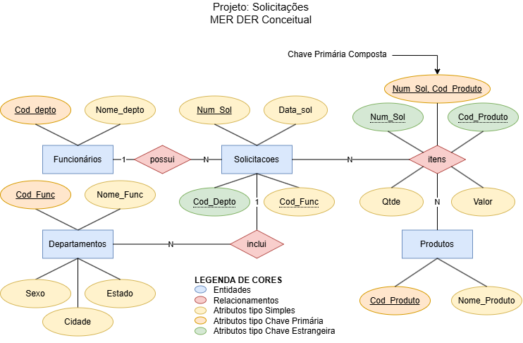

# Gabarito
- 1(40) Desenvolva o modelo **MER/DER conceitual** deste banco de dados, utiliza draw.io ou qualquer ferramenta gráfica, salve o arquivo no formato **.png** Anexe a imagem no formato *.png ao formulário desta questão. 
- 2(10) Conceitualmente, qual a cardinalidade simples do relacionamento entre as entidades **"Solicitações"** e **"Produtos"** respectivamente.
    - [ ] 1 para N (Solicitações x Produtos)
    - [x] N para N (Solicitações x Produtos)
    - [ ] 1 para 1 (Solicitações x Produtos)
    - [ ] (1,1) para (0,N) (Solicitações x Produtos)
    - [ ] (0,1) para (0,1) (Solicitações x Produtos)
- 3(05) Crie um **MER Dicionário de Dados** a partir do script de Criação **DDL**, pode formatar como **Tabela Markdow** ou **Texto com tópicos**.
## Dicionário de Dados
### 1. Funcionarios
| Coluna | Tipo | Descrição |
|-|-|-|
| Cod_Func | numeric(4)   | Código único do funcionário (PK) |
| Nome_Func | varchar(50)  | Nome do funcionário |
| Sexo | char(1) | Sexo do funcionário (M/F) |
| Cidade | varchar(30)  | Cidade onde o funcionário reside |
| Estado | varchar(2) | Sigla do estado onde o funcionário reside |
### 2. Departamentos
| Coluna | Tipo | Descrição |
|-|-|-|
| Cod_Depto  | numeric(4) | Código único do departamento (PK) |
| Nome_Depto | varchar(50) | Nome do departamento |

### 3. Produtos
| Coluna| Tipo | Descrição|
|-|-|-|
| Cod_Produto | numeric(4)  | Código único do produto (PK) |
| Nome_produto | varchar(50) | Nome do produto |
### 4. Solicitacoes
| Coluna | Tipo | Descrição |
|-|-|-|
| Num_Sol    | numeric(4)   | Número único da solicitação (PK) |
| Data_sol   | date | Data da solicitação |
| Cod_Depto  | numeric(4)   | Código do departamento relacionado (FK) |
| Cod_Func   | numeric(4)   | Código do funcionário que fez a solicitação (FK) |
## 5. Itens_Solicitacao
| Coluna | Tipo | Descrição |
|-|-|-|
| Num_Sol | numeric(4) | Número da solicitação (PK, FK) |
| Cod_Produto | numeric(4) | Código do produto (PK, FK) |
| Qtde | numeric(4) | Quantidade do produto solicitado |
| Valor | numeric(12,2)| Valor total do item |
- 4(05) Faça uma query que mostre o nome do funcionário que mais fez solicitações (em Reais), O **SELECT** deve mostrar o **nome** do funcionário e seu respectivo **valor total**.
```sql
Select f.Nome_Func, sum(i.valor) as Total
from Itens_Solicitacao i
inner join Solicitacoes s on s.Num_Sol = i.Num_Sol
inner join Funcionarios f on s.Cod_Func = f.Cod_Func
group by f.Cod_Func
order by Total desc
limit 1;
```
```
+--------------+--------+
| Nome_Func    | Total  |
+--------------+--------+
| Joao Antonio | 783.00 |
+--------------+--------+
1 row in set (0.001 sec)
```
- 5(05) Qual funcionário que mais fez solicitações? (em Reais) (Solicitações que custaram mais).
    - [x] Joao Antonio - 783.00
    - [ ] Maria da Silva - 783.25
    - [ ] Jose Pedro - 860.42
    - [ ] Ana Pereira - 783.00
- 6(05) Qual funcionário que menos fez solicitações? (em Reais) (Solicitações que custaram menos)
    - [ ] Joao Antonio - 183.00
    - [ ] Maria da Silva - 606.30
    - [ ] Jose Pedro - 60.42
    - [x] Ana Pereira - 104.50
- 7(10) Faça uma consulta que mostre os nomes dos **departamentos** e **nomes dos produtos** cujo as solicitações  contém **"Parafuso"** e **"Difusor"**.
```sql
select d.nome_depto, p.Nome_produto from departamentos d
inner join solicitacoes s on d.cod_depto = s.cod_depto
inner join itens_solicitacao i on s.Num_Sol = i.Num_Sol
inner join produtos p on i.cod_produto = p.cod_produto
where Nome_produto like "Parafuso" OR Nome_produto like "Difusor";
```
```
+------------------+--------------+
| nome_depto       | Nome_produto |
+------------------+--------------+
| Vendas           | Parafuso     |
| Vendas           | Parafuso     |
| Recursos Humanos | Parafuso     |
| Vendas           | Difusor      |
| Vendas           | Difusor      |
| Compras          | Difusor      |
| Recursos Humanos | Difusor      |
+------------------+--------------+
7 rows in set (0.001 sec)
```
- 8(10) Escreva um comando select para mostrar apenas os nomes dos produtos vendidos em **Fevereiro de 2018**.
```sql
SELECT p.Nome_produto
FROM Produtos p
WHERE p.Cod_Produto IN (
    SELECT i.Cod_Produto
    FROM Itens_Solicitacao i
    JOIN Solicitacoes s ON i.Num_Sol = s.Num_Sol
    WHERE s.Data_sol BETWEEN '2018-02-01' AND '2018-02-28'
);
-- ou
select p.Nome_produto from Produtos p
inner join Itens_Solicitacao i on i.Cod_Produto = p.Cod_Produto
inner join Solicitacoes s on s.Num_Sol = i.Num_Sol
where Year(s.Data_sol) = "2018" AND month(s.Data_sol) = "02";
```
```
+--------------+
| Nome_produto |
+--------------+
| Parafuso     |
| Difusor      |
+--------------+
2 rows in set (0.001 sec)
```
- 9(10) Crie uma **view(visão/relatório)** que mostre os seguintes campos: Num_Sol, Data_sol, Cod_Depto, Nome_Depto , Cod_Func, Nome_Func, Cod_Produto, Nome_produto, Qtde, valor e ordene por num_sol decrescente;
```sql
select s.Num_Sol, s.Data_sol , s.Cod_Depto, d.Nome_Depto,
s.Cod_Func, f.Nome_Func, i.Cod_Produto, p.Nome_produto,
i.Qtde, i.valor from solicitacoes s
inner join departamentos d on s.Cod_Depto = d.Cod_Depto
inner join funcionarios f on s.Cod_Func = f.Cod_Func
inner join itens_solicitacao i on s.Num_Sol = i.Num_Sol
inner join produtos p on i.Cod_Produto = p.Cod_Produto
order by s.num_sol desc;
```
```
+---------+------------+-----------+------------------+----------+----------------+-------------+--------------+------+--------+
| Num_Sol | Data_sol   | Cod_Depto | Nome_Depto       | Cod_Func | Nome_Func      | Cod_Produto | Nome_produto | Qtde | valor  |
+---------+------------+-----------+------------------+----------+----------------+-------------+--------------+------+--------+
|    1040 | 2019-03-24 |      2001 | Recursos Humanos |      300 | Joao Antonio   |         155 | Paralama     |    3 | 783.00 |
|    1020 | 2019-03-23 |      1000 | Vendas           |      200 | Maria da Silva |         145 | Difusor      |    2 | 170.00 |
|    1020 | 2019-03-23 |      1000 | Vendas           |      200 | Maria da Silva |         125 | Parafuso     |    1 |   2.18 |
|    1010 | 2019-02-22 |      2000 | Compras          |      100 | Jose Pedro     |         135 | Arruela      |    2 |   1.06 |
|    1010 | 2019-02-22 |      2000 | Compras          |      100 | Jose Pedro     |         145 | Difusor      |    2 | 170.00 |
|    1005 | 2018-02-10 |      2001 | Recursos Humanos |      150 | Ana Pereira    |         145 | Difusor      |    3 |  54.50 |
|    1005 | 2018-02-10 |      2001 | Recursos Humanos |      150 | Ana Pereira    |         125 | Parafuso     |    1 |  50.00 |
|    1001 | 2018-03-13 |      2001 | Recursos Humanos |      200 | Maria da Silva |         155 | Paralama     |    2 | 522.00 |
|    1001 | 2018-03-13 |      2001 | Recursos Humanos |      200 | Maria da Silva |         135 | Arruela      |    3 |   2.12 |
|    1000 | 2018-12-01 |      1000 | Vendas           |      100 | Jose Pedro     |         145 | Difusor      |    1 |  85.00 |
|    1000 | 2018-12-01 |      1000 | Vendas           |      100 | Jose Pedro     |         125 | Parafuso     |    2 |   4.36 |
+---------+------------+-----------+------------------+----------+----------------+-------------+--------------+------+--------+
11 rows in set (0.001 sec)
```
