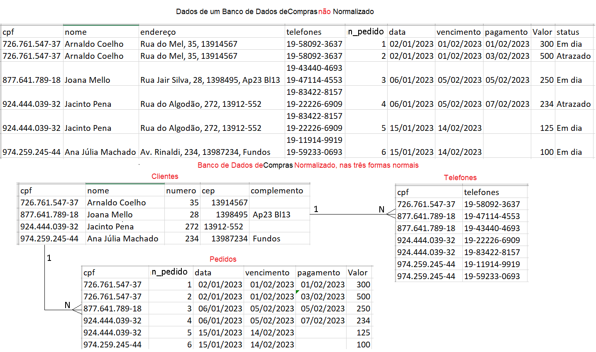
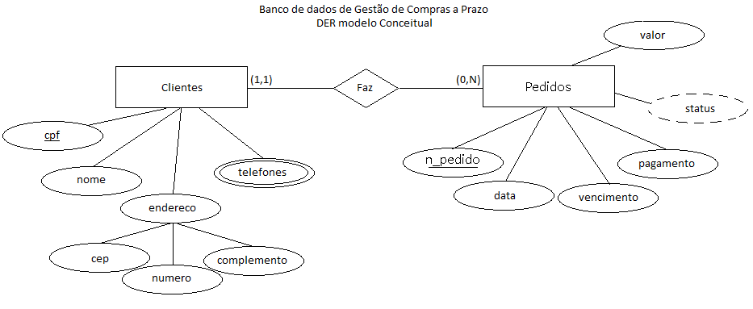
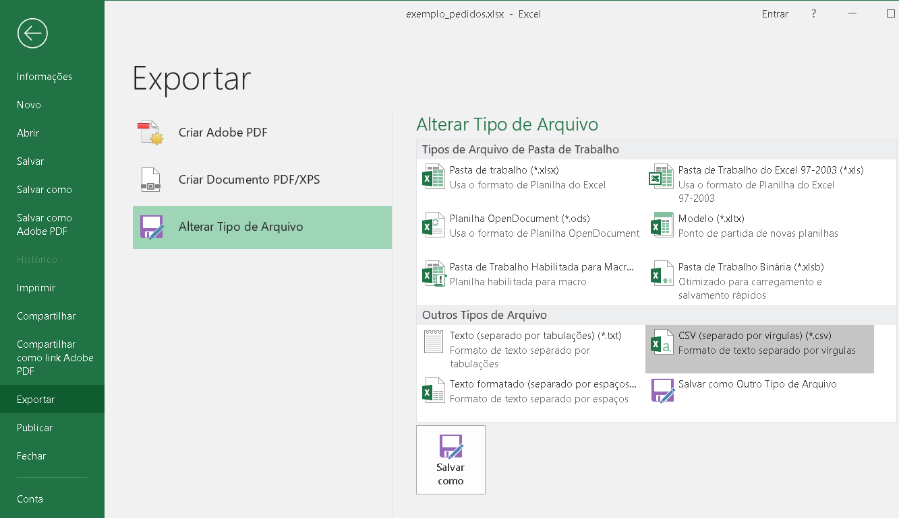

# Aula10 - Normalização e Importação de Dados
## Objetivo
O objetivo desta aula é apresentar os conceitos de normalização e importação de dados.

## Tópicos - [Apresentação PDF](./Normalizacao.pdf)
1. Normalização de Dados
2. Importação de Dados

## O que é normalização de dados?
Normalização de dados é o processo de organização de dados em um banco de dados. Isso inclui a criação de tabelas e estabelecimento de relações entre essas tabelas de acordo com regras projetadas tanto para proteger os dados quanto para tornar o banco de dados mais flexível, **eliminando** a **redundância** e a **inconsistência**.

### Benefícios
- Reduz redundância
- Reduz inconcistência
- Melhora o desempenho

### Exemplo



## O que é importação de dados?
Importação de dados é o processo de inserção de dados em um banco de dados. Isso pode ser feito de várias maneiras, como:
- A partir de um arquivo CSV
    Para isso se os dados estiverem em Excel, basta salvar cada aba/planilha como arquivo CSV e importar no banco de dados.


```csv
cpf;nome;numero;cep;complemento
726.761.547-37;Arnaldo Coelho;35;13914567;
877.641.789-18;Joana Mello;28;1398495; Ap23 Bl13
924.444.039-32;Jacinto Pena;272; 13912-552;
974.259.245-44;Ana J�lia Machado;234;13987234; Fundos
```
- Importando os dados **CSV** para a tabela `clientes`:
```sql
-- DML (Importação dos dados)
DROP DATABASE IF EXISTS pedidos;
CREATE DATABASE pedidos CHARSET=UTF8 COLLATE utf8_general_ci;
USE pedidos;
-- DDL
CREATE TABLE clientes(
    cpf varchar(15) not null PRIMARY KEY, 
    nome varchar(100) not null,
    cep varchar(11) not null,
    numero varchar(5),
    complemento varchar(50)
);

CREATE TABLE telefones(
    cpf varchar(15) not null,
    numero varchar(15) not null,
    FOREIGN KEY (cpf) REFERENCES clientes(cpf)
    on delete cascade on update cascade
);

CREATE TABLE pedidos(
    n_pedido int primary key auto_increment,
    data Date not null,
    vencimento date not null,
    pagamento date,
    valor float(10,2) not null,
    cpf varchar(15) not null,
    FOREIGN KEY (cpf) REFERENCES clientes(cpf)
);

SHOW tables;

-- DML - Popular com dados de teste
INSERT INTO clientes(cpf,nome,cep) VALUES
('111.111.111-11','jão','13558-234');

INSERT INTO telefones VALUES
('111.111.111-11','19 22222-1111');

INSERT INTO pedidos(data,vencimento,valor,cpf) VALUES
('2023-01-02','2023-02-02',200,'111.111.111-11');
`
-- DML - Importação dos dados CSV
LOAD DATA INFILE 'C:/dadoscsv/clientes.csv'
INTO TABLE clientes
FIELDS TERMINATED BY ';'
ENCLOSED BY '"'
LINES TERMINATED BY '\r\n'
IGNORE 1 ROWS;

-- DQL - Conferindo os dados
SELECT * FROM clientes;
```
- Resultado
```
MariaDB [pedidos]> SELECT * FROM clientes;
+----------------+-------------------+-----------+--------+-------------+
| cpf            | nome              | cep       | numero | complemento |
+----------------+-------------------+-----------+--------+-------------+
| 111.111.111-11 | jão               | 13558-234 | NULL   | NULL        |
| 726.761.547-37 | Arnaldo Coelho    | 35        | 13914  |             |
| 877.641.789-18 | Joana Mello       | 28        | 13984  |  Ap23 Bl13  |
| 924.444.039-32 | Jacinto Pena      | 272       |  1391  |             |
| 974.259.245-44 | Ana J?lia Machado | 234       | 13987  |  Fundos     |
+----------------+-------------------+-----------+--------+-------------+
5 rows in set (0.000 sec)
``