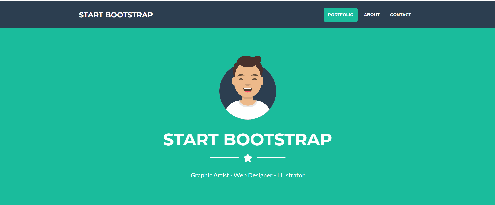

# Aula 05

## Desafio
-  Com os conhecimentos obtidos nas aulas anteriores, desenvolva as seguintes seções, utilize HTML para a parte escrita da página e o CSS para a estilização do mesmo:
  
<p>



## Entregas
- Crie um repositório público no GitHub chamado `Start-CSs`.
- Suba os arquivos HTML e CSS no repositório.
- LINK do formulário para o envio da atividade: <a href="https://forms.gle/Pf361PJDgEDuTSYu8">CLIQUE AQUI!</a>

## Correção

- HTML
```
<!DOCTYPE html>
<html lang="en">

<head>
    <meta charset="UTF-8">
    <meta name="viewport" content="width=device-width, initial-scale=1.0">
    <title>Aula 05</title>
    <link rel="stylesheet" href="style.css">
</head>

<body>
    <header>
        <div class="texto">
            <h1>START BOOTSTRAP</h1>
        </div>
        <div class="links">
            <nav>
                <a href="">Portifólio</a>
                <a href="">About</a>
                <a href="">Contact</a>
            </nav>
        </div>
    </header>
    <main>
        <div class="divimagem">
            
        </div>
        <div class="divtexto">
            <h1>START BOOTSTRAP</h1>
        </div>
        <div class="icones">
            <div class="barraesquerda">
                <hr>
            </div>
            <div class="estrela">
                
            </div>
            <div class="barradireita">
                <hr>
            </div>
        </div>
        <div class="textofinal">
            <h5>BY Paiva/Wellington</h5>
        </div>
    </main>
</body>

</html>
```

- CSS
```
*{
    margin: 0;
    padding: 0;
}

header{
    width: 100%;
    padding: 25px;
    background: black;
    display: flex;
    align-items: center;
    justify-content: space-between;

    & .texto{
        width: 50%
    }

    & .texto h1{
        font-size: 22px;
        color: white;
    }

    & .links{
        width: 50%;
    }

    & .links a{
        text-decoration: none;
        font-size: 22px;
        color: white;
        margin: 10px;
    }

    & .links a:hover{
        text-decoration: none;
        font-size: 23px;
        background: white;
        cursor: pointer;
        padding: 10px;
        color: black;
        border-radius: 15px;
    }
}

main{
    width: 100%;
    height: 320px;
    background: gray;


    & .divimagem{
        width: 100%;
        display: flex;
        align-items: center;
        justify-content: center;
        padding-top: 30px;
    }

    & .divimagem img{
        width: 100px;
        height: 100px;
    }

    & .divtexto{
        width: 100%;
        display: flex;
        align-items: center;
        justify-content: center;
        padding-top: 10px;
    }

    & .divtexto h1{
        font-size: 26px;
        color: white;
    }

    & .icones{
        width: 100%;
        display: flex;
        align-items: center;
        justify-content: center;
        padding-top: 10px;
    }

    & .icones hr{
        width: 70px;
        height: 1px;
        background: white;
    }

    & .icones img{
        width: 50px;
    }

    & .textofinal{
        width: 100%;
        display: flex;
        justify-content: center;
        align-items: center;
        padding-top: 10px;
    }

    & .textofinal h5{
        color: white;
        font-size: 16px;
    }

}
```

## Atividade Prática utilizando HTML e CSS
- Acesse o documento em anexo chamado "Lista de Exercício" e os realize. Salve em pastas sepradas, como: "Ex01", "Ex02" em diante.
- As entregas serão por formulário, faça o upload no github com o nome de "Lista de Exercícios". Acesse o link para o envio: <a href="https://forms.gle/YENEiTehkU52wGmJ7">Clique aqui</a>