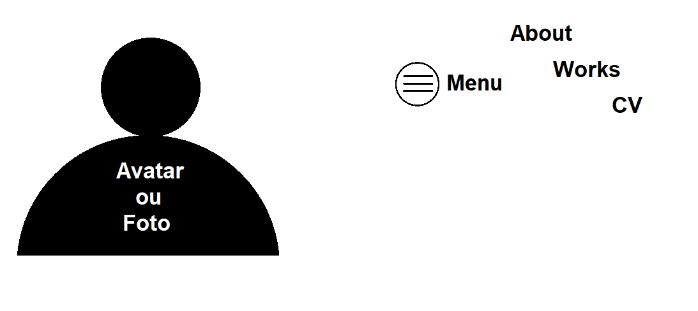
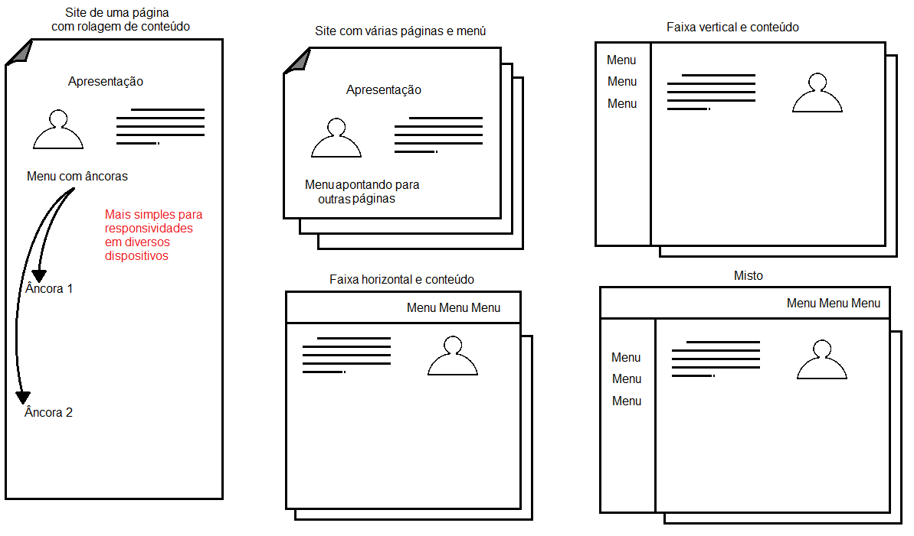
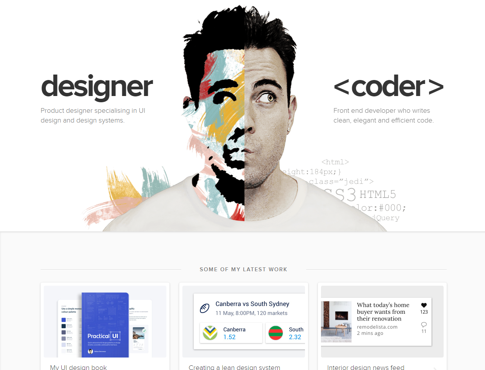
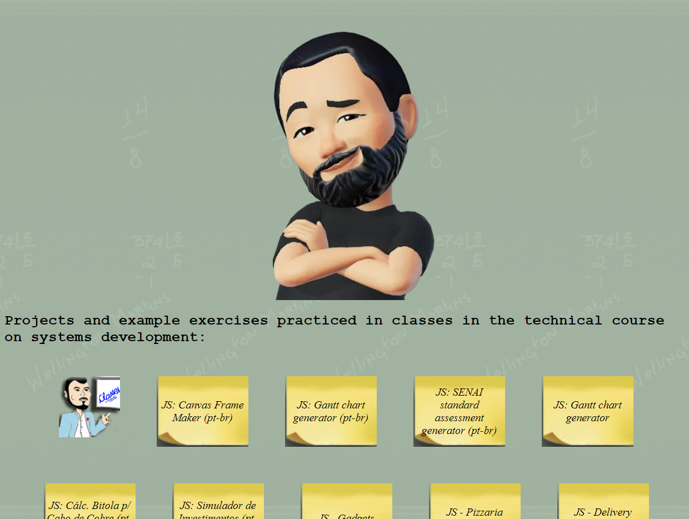
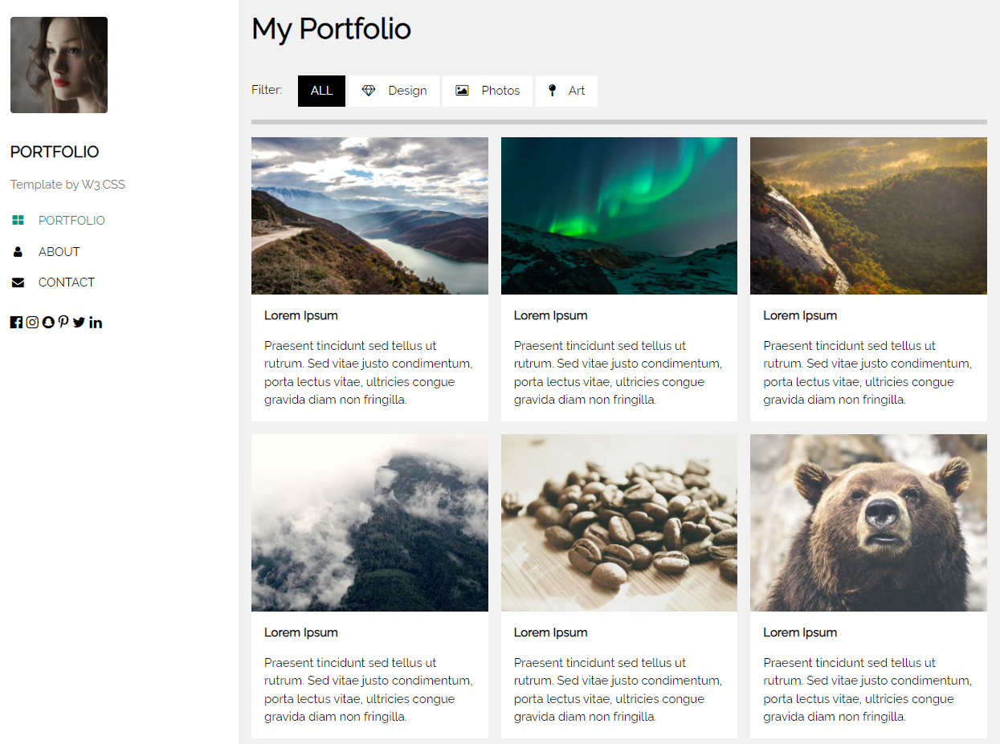

# Aula06 - Portifolio

## O que é um Portifolio?
- Portifolio é um conjunto de trabalhos realizados por um profissional ou empresa, com o objetivo de mostrar suas habilidades e competências.

## 1. Objetivo
- Criar um portifolio com as tecnologias aprendidas até o momento.
- Futuramente todos os projetos desenvolvidos serão adicionados ao portifolio.
- O portifolio será publicado no GitHub Pages.
- Tome cuidade com dados sensíveis, como CPF, RG, Endereço, etc. pois será público.

## 2. Requisitos
- HTML
- CSS
- JavaScript

## 3. Estrutura
- Home
- Sobre
- Projetos
- Contato CV

### Tipos de layouts

## Idioma
- Inglês

## Exemplos
- [Portifolio](https://www.w3schools.com/w3css/tryw3css_templates_portfolio.htm)
- [Wellifabio](https://wellifabio.github.io/)
- [Adham Danna](https://www.adhamdannaway.com/)
  
  
  
