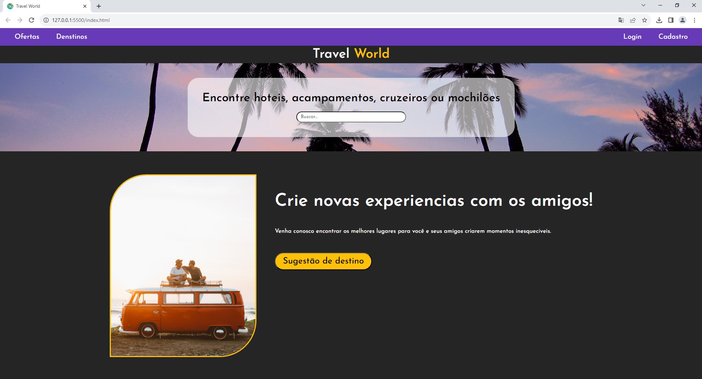

# Aula 07

## Atividade HTML + CSS

## Contextualização:
A "Travel World" é uma agência de viagens renomada, especializada em proporcionar experiências únicas e inesquecíveis para os amantes de aventuras e culturas ao redor do mundo. A empresa está buscando expandir sua presença online, atraindo um público global através de um site atraente.

## Desafio
Você como desenvolvedor front-end foi designado a criar o site baseado no layout a seguir.

## Entregas
Todas as instruções estão em nossa turma no: 

## REQUISITOS:
- Organização de pastas.
- Seguir o design.
- Uso correto das tags e identação.
- Criar um repositório para esta atividade e enviar o link no forms.

### Assets:
- @import url('https://fonts.googleapis.com/css2?family=Josefin+Sans:ital,wght@0,300;0,500;0,600;1,700&display=swap');
- font-family: 'Josefin Sans', sans-serif;
#### Paleta de cores
- Roxo: #673AB7
- Branco: #FFFFFF
- Cinza: #252525
- Amarelo: #FFC107