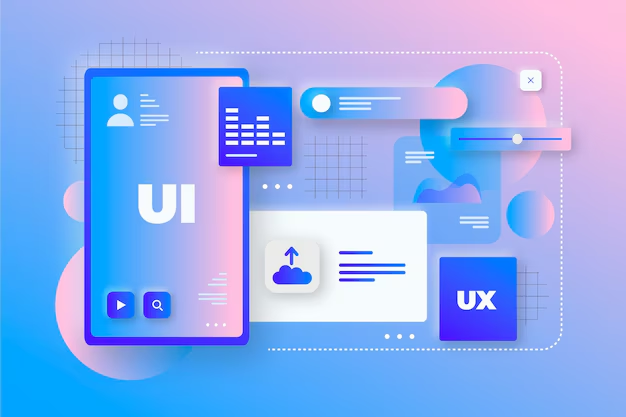

# Aula 09

- Conteúdo: UI e UX.

## O que significa UI: 
- User Interface: (Interface do usuário), é a parte visual e de interação com um determinado serviço ou produto. A UI envolve elementos como botões, menus, ícones e outros elementos visuais.

## Para que serve o UI do sistema?
- O UI é uma parte crucial do sistema, pois é a interface pela qual o usuário interage com o software. Uma interface bem projetada pode tornar a experiência do usuário mais agradável e intuitiva, facilitando a realização de tarefas e reduzindo a curva de aprendizado.

## Facilita a usabilidade do sistema
- Uma interface bem projetada permite que o usuário encontre facilmente o que está procurando e execute as ações necessárias sem dificuldades. Isso melhora a usabilidade do sistema e aumenta a satisfação do usuário, o que pode levar a uma maior fidelidade à marca e uma taxa menor de abandono.

## Ajuda a prevenir erros do usuário
- Uma interface bem projetada pode ajudar a prevenir erros do usuário, como a seleção incorreta de uma opção ou a inserção de dados incorretos. Isso pode reduzir a frustração do usuário e o tempo necessário para corrigir o erro, melhorando a eficiência do sistema.

## - Contribui para a imagem da marca
A aparência e o design da interface podem afetar a percepção do usuário sobre a marca. Uma interface mal projetada pode criar a impressão de uma empresa pouco profissional ou desorganizada, enquanto uma interface bem projetada pode transmitir uma imagem de modernidade, eficiência e confiabilidade.

## Como desenvolver um bom UI Design?
- O desenvolvimento de um bom UI Design pode ser a chave para o sucesso de um produto digital. É importante ter em mente que um bom design não se trata apenas de uma questão de estética, mas sim de funcionalidade, usabilidade e acessibilidade para o usuário final.

## O que significa UX Designer:
- O UX designer é responsável por criar experiências digitais intuitivas aos usuários. Seu trabalho consiste em entender as necessidades, desejos e comportamentos dos clientes em relação a um produto ou serviço digital, traduzindo-os em interfaces acessíveis.

## Quais as suas obrigações:
- Para isso, o profissional realiza pesquisas de mercado, análise de concorrência, entrevistas e testes de usabilidade, constatando particularidades do público-alvo e identificando oportunidades de melhoria. Isso inclui o o desenvolvimento wireframes, protótipos e fluxos de representações visuais que contribuem para o fluxo de navegação e interação do usuário com o produto.

## Responsividade:
- O que é responsividade?

- Sites responsivos são aqueles que adaptam o tamanho das suas páginas (alteração do layout) ao tamanho das telas que estão sendo exibidos, como as telas de celulares e tablets.

