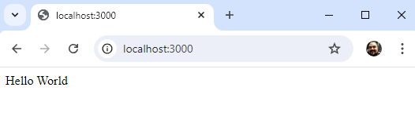

# Aula03 - NodeJS
## Objetivo
- Entender o que é NodeJS

## O que é NodeJS
- NodeJS é uma plataforma que permite a execução de código JavaScript no servidor

### O que é um servidor
- Um servidor é um programa instalado em um computador que fornece dados para outros computadores. Ex: Google, Facebook, Instagram, etc.

### Servidor HTTP
- É um servidor que fornece conexão através de um protocolo de **Resposta** a **Requisições** web para os navegadores. Ex: Apache, Nginx, IIS, etc.

|Servidores|Framework|
|-|-|
|Apache|PHP|
|Nginx|Ruby on Rails|
|IIS|.NET|
|Tomcat|Java|
|V8a|NodeJS|

## Tutorial de como inicar um projeto NodeJS
- 1 Com o  VsCode e o NodeJS instalados, crie uma Pasta para o projeto e abra com VsCode.
```bash
mkdir lojinha
cd lojinha
code .
````
- 2 Criar um arquivo `server.js` na raiz do projeto

```bash
echo "">server.js
```

- 3 Abra o terminal do VsCode `CTRL + '` e inicie o projeto NodeJS (Utilize o gerenciador de pacotes npm), antes verifique se o node está instalado com o comando `node -v`
```bash
node -v
npm init -y
```
- 3 Instale o Express no seu projeto
```bash
npm install express
```
- 4 No arquivo `server.js` e adicione o seguinte código:
```javascript
const express = require('express');

const app = express();

app.get('/', (req, res) => {
  res.send('Hello World');
});

app.listen(3000, () => {
  console.log('Respondendo na porta http://localhost:3000');
});
```
- 5 Execute o projeto
```bash
node server.js
$ou
npm start
```
- No terminal aparecerá a mensagem `Respondendo na porta http://localhost:3000`
<br>

- 6 Abra o navegador e acesse `http://localhost:3000`
<br>