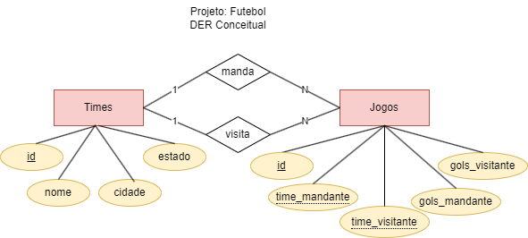
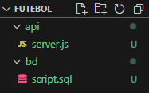
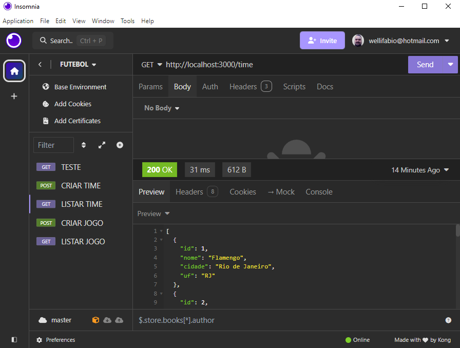

# Aula06 -  Insomnia

## Ambiente
- NodeJS
- VsCode
- Insomnia ou Postman

### Instalação
Pesquise no google, baixe e instale as versões LTS, para o seu Sistema Operacional.

## Insomnia
- Insomnia é uma ferramenta que permite testar APIs RESTful, é uma ferramenta de código aberto que pode ser usada em diferentes sistemas operacionais, como Windows, Linux e Mac OS.
- Serve para testar um **Back-end API** sem a necessidade de um **Front-end**.

### Instalação
- Baixe e instale o Insomnia, pesquise no google.
- Ao acessar faça login com seu github ou google.<br>

## Exemplo de projeto testado com insomnia
### Tema: Futebol

- 1 Crie uma pasta chamada **futebol**, abra com o **vsCode** e duas subpastas chamadas **bd** e **api**, dentro do projeto **futebol**.
- 2 Crie um arquivo chamado **script.sql** dentro da pasta **bd** e um arquivo chamado **server.js** dentro da pasta **api** conforme imagem a seguir.<br>
- 3 Abra o **script.sql** e cole o código abaixo:
```sql
drop database if exists futebol;
create database futebol;
use futebol;
create table times(
    id int primary key auto_increment,
    nome varchar(100) not null,
    cidade varchar(100) not null,
    uf varchar(2) not null
);

create table jogos(
    id int primary key auto_increment,
    time_mandante int not null,
    time_visitante int not null,
    gols_mandante int not null,
    gols_visitante int not null,
    data_jogo date not null,
    foreign key (time_mandante) references times(id),
    foreign key (time_visitante) references times(id)
);

show tables;

insert into times(nome, cidade, uf) values
('Flamengo', 'Rio de Janeiro', 'RJ'),
('Vasco', 'Rio de Janeiro', 'RJ'),
('Botafogo', 'Rio de Janeiro', 'RJ'),
('São Paulo', 'São Paulo', 'SP'),
('Parmeira', 'São Paulo', 'SP'),
('Curintia', 'São Paulo', 'SP'),
('Bragantino', 'Bragança Paulista', 'SP'),
('Grêmio', 'Porto Alegre', 'RS');

insert into jogos(time_mandante, time_visitante,
gols_mandante, gols_visitante, data_jogo) values
(1, 4, 0, 6, '2024-08-05'),
(1, 4, 0, 0, '2024-08-15'),
(4, 1, 6, 0, '2024-08-18'),
(4, 6, 2, 2, '2024-08-21');

select * from times;
select * from jogos;
```
- 4 Abra o XAMPP e inicie o Apache e o MySQL, acesse o MariaDB e execute o **script.sql**.
- 5 Abra o **server.js** e cole o código abaixo:
```js
const express = require("express");
const mysql = require("mysql");
const Cors = require("cors");

//Conexão com o banco de dados
const con = mysql.createConnection({
    host: "localhost",
    user: "root",
    database: "futebol"
});

//Controles
const teste = (req, res) => {
    res.send("API Futebol Respondendo");
}
const listarTime = (req, res) => {
    con.query("SELECT * FROM times", (err, result) => {
        if (err) {
            res.status(500).json("Erro ao consultar o BD").end();
        }
        res.json(result).end();
    });
}
const listarJogo = (req, res) => {
    con.query("SELECT * FROM jogos", (err, result) => {
        if (err) {
            res.status(500).json("Erro ao consultar o BD").end();
        }
        res.json(result).end();
    });
}
const criarTime = (req, res) => {
    con.query("INSERT INTO times SET ?", req.body, (err, result) => {
        if (err) {
            res.status(500).json("Erro ao inserir no BD").end();
        }
        const criado = req.body;
        criado.id = result.insertId;
        res.status(201).json(criado).end();
    });
}
const criarJogo = (req, res) => {
    con.query("INSERT INTO jogos SET ?", req.body, (err, result) => {
        if (err) {
            res.status(500).json("Erro ao inserir no BD").end();
        }
        const criado = req.body;
        criado.id = result.insertId;
        res.status(201).json(criado).end();
    });
}


//Configuração do servidor
const app = express();
app.use(Cors());
app.use(express.json());
app.get("/", teste);

//Rotas
app.get("/time", listarTime);
app.get("/jogo", listarJogo);
app.post("/time", criarTime);
app.post("/jogo", criarJogo);

app.listen(3000, () => {
    console.log("API futebol porta 3000");
});
```
- 6 Abra o terminal, navegue até a pasta **api**, inicie o projeto NodeJS e instale as dependências **express, mysql e cors** e inicie o servidor com os comandos:
```bash
cd api
npm init -y
npm install express mysql cors
npm i nodemon -g
nodemon
```
7 - Abra o Insomnia e crie uma nova coleção chamada **Futebol** com as 5 rotas a seguir conforme imagem:

- TESTE: GET http://localhost:3000/
- LISTAR TIMES: GET http://localhost:3000/time
- LISTAR JOGOS: GET http://localhost:3000/jogo
- CRIAR TIME: POST http://localhost:3000/time
- CRIAR JOGO: POST http://localhost:3000/jogo

## Códigos HTTP status
|Codigo|Significado|CRUD|
|-|-|-|
|200|OK|Read|
|201|Created|Create|
|202|Accepted|Update|
|204|No Content|Delete|
|400|Bad Request|Erro do Cliente|
|401|Unauthorized|Erro do Cliente|
|403|Forbidden|Erro do Cliente|
|404|Not Found|Erro do Cliente|
|500|Internal Server Error|Erro do Servidor|

## CRUD
### SQL - DML
- **Create** - INSERT INTO tabela SET ?
- **Read** - SELECT * FROM tabela
- **Update** - UPDATE tabela SET ? WHERE id = ?
- **Delete** - DELETE FROM tabela WHERE id = ?
### REST - HTTP
- **Create** - POST /tabela
- **Read** - GET /tabela
- **Update** - PUT /tabela/:id
- **Delete** - DELETE /tabela/:id

|Banco de Dados|CRUD|Back-End|CRUD|Front-End|
|-|-|-|-|-|
||SQL||REST-HTTP||

