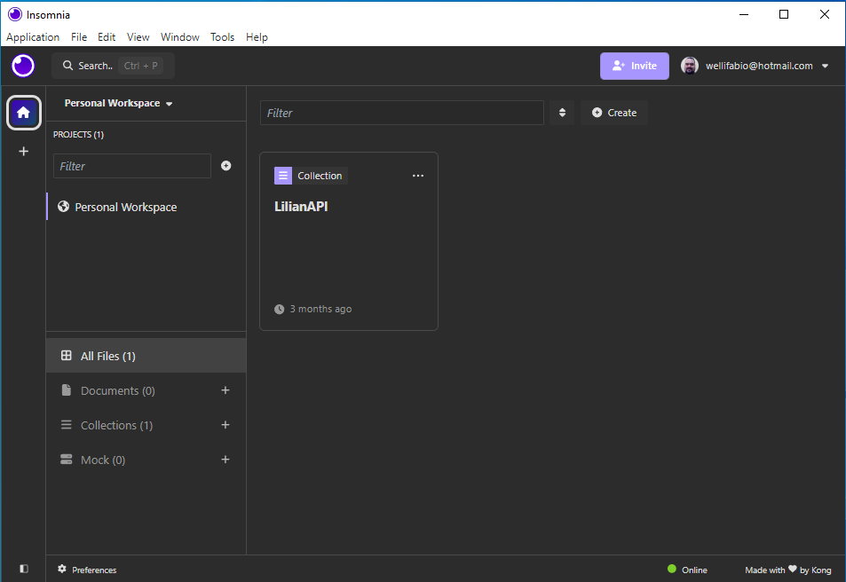

# Aula06 -  Insomnia

## Ambiente
- NodeJS
- VsCode
- Insomnia ou Postman

### Instalação
Pesquise no google, baixe e instale as versões LTS, para o seu Sistema Operacional.

## Insomnia
- Insomnia é uma ferramenta que permite testar APIs RESTful, é uma ferramenta de código aberto que pode ser usada em diferentes sistemas operacionais, como Windows, Linux e Mac OS.
- Serve para testar um **Back-end API** sem a necessidade de um **Front-end**.

### Instalação
- Baixe e instale o Insomnia, pesquise no google.
- Ao acessar faça login com seu github ou google. 

