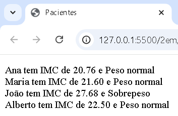

# Aula07 - POO (Programação Orientada a Objetos)

## Objetivos
- Entender o conceito de POO
- Entender o conceito de classe e objeto
- Entender Diagrama de Classes da UML

## O que é POO
É um paradigma de programação que utiliza objetos para representar entidades do mundo real. Cada objeto possui características (atributos) e comportamentos (métodos).

## UML - Diagrama de Classes
UML (Unified Modeling Language) é uma linguagem de modelagem que permite visualizar o design de um sistema. O diagrama de classes é um dos diagramas mais utilizados na UML e representa a estrutura de um sistema.

O diagrama de classes acima representa a classe `Automovel` com os atributos `placa`, `modelo`, `valor` e `cor` e ométodo calcDesconto().

## Exemplo de Classe em JavaScript com HTML
EM JavaScriopt podemos criar objetos diretamente sem a necessidade de criar uma classe. No entanto, é possível criar classes em JavaScript. Veja os exemplos abaixo:
```html
<!doctype HTML>
<html>
<head>
	<meta charset="UTF-8">
	<meta name="viewport" content="width=device-width, initial-scale=1.0">
	<title>Objetos</title>
</head>
<body>
	<p id="paragrafo"></p>
</body>
<script>
	const obj={} //Objeto vazio
	obj.modelo = "UNO";
	obj.cor = "Vermelho";
	obj.placa = "ABC-1234";

	const p = document.getElementById("paragrafo");
	p.innerHTML = "Modelo: " + obj.modelo;
	p.innerHTML += "<br>Cor: " + obj.cor;
	p.innerHTML += "<br>Placa: " + obj.placa;
</script>
</html>
```
A saída do código acima será: 
O exemplo abaixo mostra como criar um objeto já preenchido:
```html
<!doctype HTML>
<html>
<head>
	<meta charset="UTF-8">
	<meta name="viewport" content="width=device-width, initial-scale=1.0">
	<title>Objetos</title>
</head>
<body>
	<p id="paragrafo"></p>
</body>
<script>
	const obj={} //Objeto vazio
	const fiat = {
		modelo:"UNO",
		cor:"Amarelo",
		placa:"AAA-1A11",
		valor:15000.00
	}
	const p = document.getElementById("paragrafo");
	p.innerHTML = "Modelo: " + fiat.modelo;
	p.innerHTML += "<br>Cor: " + fiat.cor;
	p.innerHTML += "<br>Placa: " + fiat.placa;
	p.innerHTML += "<br>Valor: R$" + fiat.valor.toFixed(2);
</script>
</html>
```
A saída do código acima será: 
O exemplo abaixo mostra como criar uma classe em JavaScript:
```html
<!doctype HTML>
<html>
<head>
	<meta charset="UTF-8">
	<meta name="viewport" content="width=device-width, initial-scale=1.0">
	<title>Objetos</title>
</head>
<body>
	<p id="paragrafo"></p>
</body>
<script>
	class Automovel{
		modelo;
		cor;
		placa;
		valor;
		calcDesconto(porcentagem){
			return this.valor * porcentagem / 100;
		}
	}
	const p = document.querySelector("#paragrafo"); //Objeto HTML
	const fiat = new Automovel(); //Objeto a partir de uma classe (Instância)
	fiat.modelo = "UNO";
	fiat.cor = "Amarelo";
	fiat.placa = "AAA-1A11";
	fiat.valor = 15000;
	p.innerHTML = "Modelo: " + fiat.modelo;
	p.innerHTML += "<br>Cor: " + fiat.cor;
	p.innerHTML += "<br>Placa: " + fiat.placa;
	p.innerHTML += "<br>Valor: R$" + fiat.valor.toFixed(2);
	p.innerHTML += "<br>Desconto: R$" + fiat.calcDesconto(10).toFixed(2);
</script>
</html>
```
Utilizando classes em JavaScript, podemos criar objetos a partir de uma classe e utilizar **métodos**. A saída do código acima será: 

## Exercícios
A partir dos diagramas de classes abaixo, crie as classes em JavaScript e crie objetos a partir das classes.
1. 
- Para o cálculo do valor total basta multiplicar a quantidade pelo preço.
2. 
- Para o cálculo do IMC (Índice de Massa Corporal) basta dividir o peso pela altura ao quadrado.
- O diagnóstico é obtido a partir do IMC:
  - IMC < 18,5: Abaixo do peso
  - IMC >= 18,5 e IMC < 24,9: Peso normal
  - IMC >= 25 e IMC < 29,9: Sobrepeso
  - IMC >= 30 e IMC < 34,9: Obesidade Grau I
  - IMC >= 35 e IMC < 39,9: Obesidade Grau II
  - IMC >= 40: Obesidade Grau III

## Listas de Objetos
É possível criar listas de objetos em JavaScript. Veja o exemplo abaixo:
```html
<!doctype HTML>
<html>

<head>
	<meta charset="UTF-8">
	<meta name="viewport" content="width=device-width, initial-scale=1.0">
	<title>Pacientes</title>
</head>

<body>
	<p id="paragrafo"></p>
</body>
<script>
	class Paciente {
		constructor(nome, peso, altura) {
			this.nome = nome;
			this.peso = peso;
			this.altura = altura;
		}
		calcIMC() {
			return this.peso / (this.altura * this.altura);
		}
		diagnostico() {
			const imc = this.calcIMC();
			if (imc < 18.5) {
				return "Abaixo do peso";
			} else if (imc < 25) {
				return "Peso normal";
			} else if (imc < 30) {
				return "Sobrepeso";
			} else if (imc < 35) {
				return "Obesidade grau 1";
			} else if (imc < 40) {
				return "Obesidade grau 2";
			} else {
				return "Obesidade grau 3";
			}
		}
	}
	const p = document.querySelector("#paragrafo"); //Objeto HTML
	const ana = new Paciente("Ana", 60, 1.70);
	const maria = new Paciente("Maria", 70, 1.80);
	const joao = new Paciente("João", 80, 1.70);
	const alberto = new Paciente("Alberto", 90, 2.00);

	const pacientes = [ana, maria, joao, alberto];
	for (let i = 0; i < pacientes.length; i++) {
		p.innerHTML += `${pacientes[i].nome} tem IMC de ${pacientes[i].calcIMC().toFixed(2)} e ${pacientes[i].diagnostico()}<br>`;
	}

</script>

</html>
```
A saída do código acima será: <br>
No exemplo acima, criamos uma lista de objetos do tipo paciente, também utilizamos um **método contrutor** para inicializar os atributos da classe, isto simplifica a criação de objetos.

## Exercícios
1. Crie uma lista de objetos a partir do diagrama de classes de pedidos 
Porém represente a lista em uma tabela HTML e na ultima ínha some o **total geral** dos pedidos.
2. Faça uma estilização com CSS semelhante a da imagem abaixo:
