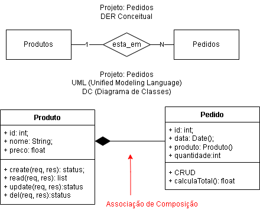

# Aula 11
## Orientação a Objetos
### Relações entre Objetos

- Composição
- Agregação
- Herança

### Exemplo de Composição
Vamos utilizar o projeto simples de pedidos para exemplificar a composição.

Neste exemplo a classe Pedido é composta por no mínimo um e no máximo um produto. a dependência é forte, sem produto não existe pedido.
```sql
drop database if exists pedidos;
create database pedidos;
use pedidos;
create table produtos(
    id int primary key auto_increment,
    nome varchar(100) not null,
    preco decimal(10,2) not null
);
create table pedidos(
    id int primary key auto_increment,
    data_pedido datetime not null default(now()),
    produto int not null,
    quantidade int not null,
    foreign key(produto) references produtos(id)
);

-- Em um banco de dados relacional não é possível demonstrar composição de objetos,
-- como por exemplo, um pedido ter um ou mais produtos. Para isso, é necessário criar uma
-- tabela de relacionamento entre pedidos e produtos. No entanto, para simplificar o exemplo,
-- vamos considerar que um pedido possui apenas um produto.
-- Para ver a composição de objetos, podemos programar em uma linguagem de programação Back-END por exemplo.

-- Vamos criar uma visão para mostrar os pedidos com os produtos.
CREATE VIEW vw_pedidos AS
SELECT
    ped.*,
    prod.nome,
    prod.preco,
    prod.preco * ped.quantidade as total
FROM pedidos ped
INNER JOIN produtos prod ON prod.id = ped.produto;
```
- Vamos ver esta visão em um back-end NodeJS
- Arquivo ./src/controllers/pedidoComposto.js
```javascript
const con = require('../connect');
const read = (req, res) => {
    con.query('SELECT * FROM vw_pedidos', 
        (err, result) => {
            if (err) {
                return res.status(500).json({ error: err.message });
            }
            return res.status(200).json(result);
        }
    );
}
module.exports = { read };
```
- O resultado em JSON visto no vavegador ou insomnia na rotas GET http://localhost:3000/pedidoscompostos
```json
[
	{
		"id": 1,
		"data_pedido": "2024-11-22T13:24:51.000Z",
		"produto": 1,
		"quantidade": 2,
		"nome": "MogoG 8",
		"preco": 2200,
		"total": 4400
	},
	{
		"id": 2,
		"data_pedido": "2024-11-22T13:26:43.000Z",
		"produto": 2,
		"quantidade": 1,
		"nome": "IPhone 16",
		"preco": 14200,
		"total": 14200
	},
	{
		"id": 3,
		"data_pedido": "2024-11-22T13:27:24.000Z",
		"produto": 3,
		"quantidade": 1,
		"nome": "Sansung Galaxy S24",
		"preco": 8200,
		"total": 8200
	}
]
```