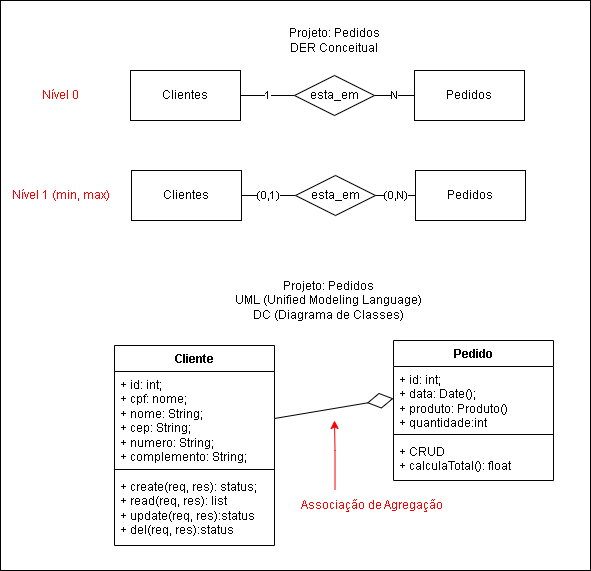

# Aula 11
## Orientação a Objetos
### Relações entre Objetos

- Composição
- Agregação
- Herança

### Exemplo de Composição
Vamos utilizar o projeto simples de pedidos para exemplificar a composição.
<br><br>
Neste exemplo a classe Pedido é composta por no mínimo um e no máximo um produto. a dependência é forte, sem produto não existe pedido.
```sql
drop database if exists pedidos;
create database pedidos;
use pedidos;
create table produtos(
    id int primary key auto_increment,
    nome varchar(100) not null,
    preco decimal(10,2) not null
);
create table pedidos(
    id int primary key auto_increment,
    data_pedido datetime not null default(now()),
    produto int not null,
    quantidade int not null,
    foreign key(produto) references produtos(id)
);

-- Em um banco de dados relacional não é possível demonstrar composição de objetos,
-- como por exemplo, um pedido ter um ou mais produtos. Para isso, é necessário criar uma
-- tabela de relacionamento entre pedidos e produtos. No entanto, para simplificar o exemplo,
-- vamos considerar que um pedido possui apenas um produto.
-- Para ver a composição de objetos, podemos programar em uma linguagem de programação Back-END por exemplo.

-- Vamos criar uma visão para mostrar os pedidos com os produtos.
CREATE VIEW vw_pedidos AS
SELECT
    ped.*,
    prod.nome,
    prod.preco,
    prod.preco * ped.quantidade as total
FROM pedidos ped
INNER JOIN produtos prod ON prod.id = ped.produto;
```
- Vamos ver esta visão em um back-end NodeJS
- Arquivo ./src/controllers/pedidoComposto.js
```javascript
const con = require('../connect');
const read = (req, res) => {
    con.query('SELECT * FROM vw_pedidos', 
        (err, result) => {
            if (err) {
                return res.status(500).json({ error: err.message });
            }
            return res.status(200).json(result);
        }
    );
}
module.exports = { read };
```
- O resultado em JSON visto no vavegador ou insomnia na rotas GET http://localhost:3000/pedidoscompostos
```json
[
	{
		"id": 1,
		"data_pedido": "2024-11-22T13:24:51.000Z",
		"produto": 1,
		"quantidade": 2,
		"nome": "MogoG 8",
		"preco": 2200,
		"total": 4400
	},
	{
		"id": 2,
		"data_pedido": "2024-11-22T13:26:43.000Z",
		"produto": 2,
		"quantidade": 1,
		"nome": "IPhone 16",
		"preco": 14200,
		"total": 14200
	},
	{
		"id": 3,
		"data_pedido": "2024-11-22T13:27:24.000Z",
		"produto": 3,
		"quantidade": 1,
		"nome": "Sansung Galaxy S24",
		"preco": 8200,
		"total": 8200
	}
]
```
- Agora alteramos o código back-end para mostrar o pedido composto por um produto como um objeto.
- Arquivo ./src/controllers/pedidoComposto.js
```js
const con = require('../connect');
const read = async (req, res) => {
    con.query('SELECT * FROM vw_pedidos',
        async (err, result) => {
            if (err) {
                return res.status(500).json({ error: err.message });
            }
            const retorno = await compor(result);
            return res.status(200).json(retorno);
        }
    );
}

async function compor(pedidos) {
    let produtos = [];
    pedidos.forEach(p => {
        const produto = { id: p.produto, nome: p.nome, preco: p.preco };
        const pedido = { id: p.id, data: p.data_pedido, produto, quantidade: p.quantidade, total: p.total };
        produtos.push(pedido);
    });
    return produtos;
}

module.exports = { read };
```
A função compor cria um objeto pedido com um objeto produto. O resultado em JSON visto no vavegador ou insomnia na rotas GET http://localhost:3000/pedidoscompostos
```json
[
	{
		"id": 1,
		"data": "2024-11-22T13:24:51.000Z",
		"produto": {
			"id": 1,
			"nome": "MogoG 8",
			"preco": 2200
		},
		"quantidade": 2,
		"total": 4400
	},
	{
		"id": 2,
		"data": "2024-11-22T13:26:43.000Z",
		"produto": {
			"id": 2,
			"nome": "IPhone 16",
			"preco": 14200
		},
		"quantidade": 1,
		"total": 14200
	},
	{
		"id": 3,
		"data": "2024-11-22T13:27:24.000Z",
		"produto": {
			"id": 3,
			"nome": "Sansung Galaxy S24",
			"preco": 8200
		},
		"quantidade": 1,
		"total": 8200
	}
]
```
[Segue aqui uma API Back-end completa do exemplo da relação de composição](./composicao/)

### Exemplo de Agregação
Vamos continuar utilizando o projeto de pedidos para exemplificar a agregação. Adicionaremos uma tabela de clientes onde este poderá ter um ou mais pedidos. E o pedido pode ou não ser relacionado a um cliente.

<br><br>
```sql
drop database if exists pedidos;
create database pedidos;
use pedidos;
create table produtos(
    id int primary key auto_increment,
    nome varchar(100) not null,
    preco decimal(10,2) not null
);
create table pedidos(
    id int primary key auto_increment,
    data_pedido datetime not null default(now()),
    produto int not null,
    quantidade int not null,
    foreign key(produto) references produtos(id)
);

-- Vamos criar uma visão para mostrar os pedidos com os produtos.
DROP VIEW IF EXISTS vw_pedidos;
CREATE VIEW vw_pedidos AS
SELECT
    ped.*,
    prod.nome,
    prod.preco,
    prod.preco * ped.quantidade as total
FROM pedidos ped
INNER JOIN produtos prod ON prod.id = ped.produto;

-- Vamos alterar o Banco de dados (acrescentando uma tabela de clientes)
-- sem perder os dados já cadastrados.
create table clientes(
    id int primary key not null auto_increment,
    cpf varchar(15) not null unique,
    nome varchar(100) not null,
    cep varchar(15) not null,
    numero varchar(10),
    complemento varchar(100)
);

-- Vamos criar o relacionamento de clientes com pedidos
alter table pedidos
    add column cliente int;
alter table pedidos
    add foreign key(cliente)
    references clientes(id)
    on delete set null;

-- Vamos criar uma visão para mostrar os clientes com os pedidos.
DROP VIEW IF EXISTS vw_clientes;
CREATE VIEW vw_clientes AS
SELECT
    cli.*,
    vp.id as pedido,
    vp.data_pedido,
    vp.produto,
    vp.nome as produto_nome,
    vp.preco,
    vp.quantidade,
    vp.total
FROM clientes cli
LEFT JOIN vw_pedidos vp ON vp.cliente = cli.id;
```

- Vamos ver esta visão em um back-end NodeJS
- Arquivo ./src/controllers/clienteAgregado.js
```javascript
const con = require('../connect');
const read = async (req, res) => {
    con.query('SELECT * FROM vw_clientes',
        async (err, result) => {
            if (err) {
                return res.status(500).json({ error: err.message });
            }
            const clientes = await agregar(result);
            return res.status(200).json(clientes);
        }
    );
}

async function agregar(clientes) {
    let novaLista = [];
    let ultimo = null;
    clientes.forEach(c => {
        const cliente = { id: c.id, nome: c.nome, cep: c.cep, numero: c.numero, complemento: c.complemento };
        const produto = { id: c.produto, nome: c.produto_nome, preco: c.preco };
        const pedido = { id: c.pedido, data: c.data_pedido, quantidade: c.quantidade, produto, total: c.total };
        cliente.pedidos = [];
        if (pedido.id != null) { cliente.pedidos.push(pedido); }
        if (ultimo && ultimo.id === c.id) {
            novaLista[novaLista.length - 1].pedidos.push(pedido);
            return;
        }
        novaLista.push(cliente);
        ultimo = cliente;
    });
    return novaLista;
}

module.exports = { read };
```
O resultado em JSON visto no vavegador ou insomnia na rotas GET http://localhost:3000/clientesagregados
```json
[
	{
		"id": 1,
		"nome": "Ana Silva",
		"cep": "13444-444",
		"numero": null,
		"complemento": null,
		"pedidos": [
			{
				"id": 5,
				"data": "2024-11-25T12:11:48.000Z",
				"quantidade": 1,
				"produto": {
					"id": 1,
					"nome": "Camiseta",
					"preco": 49.9
				},
				"total": 49.9
			},
			{
				"id": 6,
				"data": "2024-11-25T12:59:45.000Z",
				"quantidade": 2,
				"produto": {
					"id": 1,
					"nome": "Camiseta",
					"preco": 49.9
				},
				"total": 99.8
			}
		]
	},
	{
		"id": 2,
		"nome": "João Santos",
		"cep": "13444-444",
		"numero": null,
		"complemento": null,
		"pedidos": []
	}
]
```