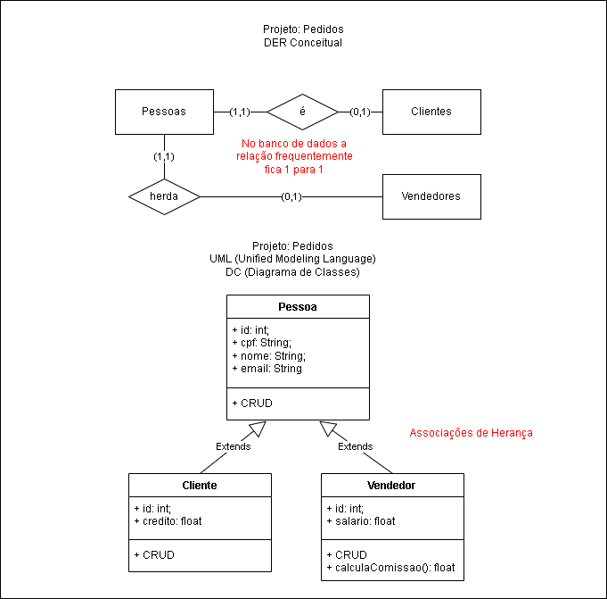

# Projeto pedidos
## Exemplo de agregação de pedidos a clientes

## Ambiente
- VsCode
- NodeJS
- MySQL
## Passo a passo para executar
- 1. Clonar o projeto
- 2. Abrir com VsCode e abrir um terminal **cmd** ou **bash** navegar até a pasta api e instalar as dependências.
```bash
cd api
npm install
```
- 3. Criar o banco de dados pedidos, abrindo o XAMPP e iniciar o MySQL e Apache. Rodar o script ./bd/pedidos.sql
- 4. Iniciar a API
```bash
npm start
#ou
npx nodemon
```
- 5. Testar a API com o Insomnia importando o script ./

## Exemplo de saída da rota vendedores
A saída com a lista de clientes agregados dos pedidos é:
```json

```