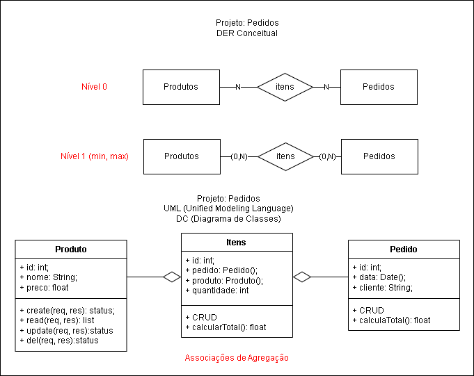

# Projeto pedidos
## Exemplo de agregação de pedidos

## Ambiente
- VsCode
- NodeJS
- MySQL
## Passo a passo para executar
- 1. Clonar o projeto
- 2. Abrir com VsCode e abrir um terminal **cmd** ou **bash** navegar até a pasta api e instalar as dependências.
```bash
cd api
npm install
```
- 3. Criar o banco de dados pedidos, abrindo o XAMPP e iniciar o MySQL e Apache. Rodar o script ./bd/pedidos.sql
- 4. Iniciar a API
```bash
npm start
#ou
npx nodemon
```
- 5. Testar a API com o Insomnia importando o script ./insomnia.json

## Exemplo de agregação de pedidos N para N com produtos
```sql
drop database if exists pedidos;
create database pedidos;
use pedidos;
create table produtos(
    id int primary key auto_increment,
    nome varchar(100) not null,
    preco decimal(10,2) not null
);

create table pedidos(
    id int primary key auto_increment,
    nome_cliente varchar(100) not null,
    data_pedido datetime not null default(now())
);

create table itens_pedido(
    id int primary key auto_increment,
    pedido int not null,
    produto int not null,
    quantidade int not null,
    foreign key (pedido) references pedidos(id),
    foreign key (produto) references produtos(id)
);

-- A tabela itens_pedido é uma tabela de relacionamento entre pedidos e produtos.
-- Neste formato podemos criar pedidos sem nenhum item e agregar os ítens posteriormente.

-- Vamos criar uma visão para mostrar os pedidos com os produtos.
-- Primeiro vamos criar uma visão com os itens e dados dos produtos.
CREATE VIEW vw_itens AS
SELECT 
    i.id,
    i.pedido,
    i.produto,
    i.quantidade,
    prod.nome,
    prod.preco,
    prod.preco * i.quantidade as total
FROM itens_pedido i
JOIN produtos prod ON i.produto = prod.id;
-- Agora vamos criar uma visão com os pedidos e os itens.
CREATE VIEW vw_pedidos AS
SELECT
    ped.id,
    ped.data_pedido,
    ped.nome_cliente,
    iv.id as item_id,
    iv.produto,
    iv.quantidade,
    iv.nome,
    iv.preco,
    iv.total
FROM pedidos ped
LEFT JOIN vw_itens iv ON ped.id = iv.pedido;

-- Vamos inserir alguns produtos.
insert into produtos(nome, preco) values('Produto 1', 10.00);
insert into produtos(nome, preco) values('Produto 2', 20.00);
insert into produtos(nome, preco) values('Produto 3', 30.00);
insert into produtos(nome, preco) values('Produto 4', 40.00);

-- Vamos inserir um pedido.
insert into pedidos(nome_cliente) values('Cliente 1');
-- Vamos inserir os itens do pedido.
insert into itens_pedido(pedido, produto, quantidade) values(1, 1, 2);
insert into itens_pedido(pedido, produto, quantidade) values(1, 2, 1);

-- Vamos inserir outro pedido.
insert into pedidos(nome_cliente) values('Cliente 2');
-- Vamos inserir os itens do pedido.
insert into itens_pedido(pedido, produto, quantidade) values(2, 3, 3);

-- Vamos inserir mais um pedido.
insert into pedidos(nome_cliente) values('Cliente 3');

-- Vamos executar as visões.
select * from vw_itens;
select * from vw_pedidos;

-- Note que mesmo o pedido de id 3 não tem itens, ele é exibido na visão vw_pedidos, pois usamos left join.
```
Classe pedidoAgregado.js
```javascript
const con = require('../connect');
const read = async (req, res) => {
    con.query('SELECT * FROM vw_pedidos',
        async (err, result) => {
            if (err) {
                return res.status(500).json({ error: err.message });
            }
            const produtos = await agregar(result);
            return res.status(200).json(produtos);
        }
    );
}

async function agregar(pedidos) {
    let novaLista = [];
    let ultimo = null;
    let total = 0;
    pedidos.forEach(p => {
        const pedido = { id: p.id, data: p.data_pedido, total: p.total, cliente: p.cliente };
        const produto = { id: p.produto, nome: p.nome, quantidade: p.quantidade, preco: p.preco };
        pedido.produtos = [];
        if (p.produto != null) { pedido.produtos.push(produto); }
        if(ultimo && ultimo.id == pedido.id) {
            novaLista[novaLista.length - 1].total += produto.preco * produto.quantidade;
            novaLista[novaLista.length - 1].produtos.push(produto);
            return;
        }
        novaLista.push(pedido);
        ultimo = pedido;
    });
    return novaLista;
}

module.exports = { read };
```
Resultado depois do BackEnd rodar:
```json
[
	{
		"id": 1,
		"data": "2024-11-25T14:01:27.000Z",
		"total": 100,
		"produtos": [
			{
				"id": 1,
				"nome": "Produto 1",
				"quantidade": 2,
				"preco": 10
			},
			{
				"id": 2,
				"nome": "Produto 2",
				"quantidade": 1,
				"preco": 20
			},
			{
				"id": 2,
				"nome": "Produto 2",
				"quantidade": 3,
				"preco": 20
			}
		]
	},
	{
		"id": 2,
		"data": "2024-11-25T14:01:27.000Z",
		"total": 90,
		"produtos": [
			{
				"id": 3,
				"nome": "Produto 3",
				"quantidade": 3,
				"preco": 30
			}
		]
	},
	{
		"id": 3,
		"data": "2024-11-25T14:01:27.000Z",
		"total": null,
		"produtos": []
	},
	{
		"id": 4,
		"data": "2024-11-25T14:04:28.000Z",
		"total": null,
		"produtos": []
	}
]
```