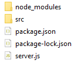
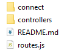

# Aula04

|Contextualização do Desafio|
|-|
|Como integrante do time de programadores da empresa XPTO, você possui como um de seus clientes a empresa XPTUK e está trabalhando em um projeto que visa o gerenciamento de Alunos na academia. Com base nisso, o seu gerente requeriu que você desse continuidade no desenvolvimento utilizando as seguintes linguagens e ferramentas: |

```
Node.js
Mysql (Xampp)
HTML
CSS
Prisma
```

## Instruções
- O **Projeto-Academia** será desenvolvido em duas etapas, então em sua pasta **DOCUMENTOS** crie o arquivo *Projeto-Academia* e dentro do mesmo crie as seguintes pastas abaixo:

- **1ª Pasta**: **Front End**, onde será desenvolvido na aula de **LIMA** na Terça-feira das 07:30 até as 11:30. Nessa pasta como feito nas aulas anteriores será utilizado as linguagens HTML e CSS para a personalização da mesma.  
- **2ª Pasta**: **Back-End**, onde será desenvolvido na aula de **PBE1** na Quarta-Feira das 07:30 até as 15:30. Nessa pasta você irá utilizar as seguintes linguagens:
  
```
Node.js
SQL (Xampp)
```
- Ainda na pasta Back-end, antes de iniciar a programação, você deve separar a seguinte pasta:
  
- você irá criar o arquivo **server.js** para inicializar o servidor. E a pasta **SRC** para adicionar a mesma estrutura que utilizamos na aula06.

### Abaixo a imagem de como deve ficar dentro da pasta SRC
  


- A pasta **connect** será responsável pela conexão com o banco de dados.
- A pasta **controllers** será responsável pelo CRUD do projeto, onde será feiro o (Criar e Listar)
- O Arquivo **routes.js** será responsável por adicionar as rotas, que foram feitas no arquivo dentro da pasta controllers. 

#### Obs: Caso haja alguma dúvida na programação, basta abrir o projeto da aula06 no visual studio e seguir os mesmos passos.

- Ainda dentro da pasta **Back-End**, siga as instruções abaixo para instalar as dependências:

- Abra o terminal e digite os seguintes comandos na pasta :
```
    cd Back-End
    npm init
```
- Pressione ENTER até o final.
- Instale as dependências iniciais:
```
    npm i express
    npm i cors
    npm i mysql
```
### Agora criaremos juntos o arquivo server.js na pasta Back-End
```
// Dependências para rodar o servidor
const express = require ('express')
const cors = require('cors')
const routes = require("./src/routes")

//Configurações de saída - App -> Front ou Mobile
const app = express();
app.use(express.json());
app.use(cors());
app.use(routes);


// Rota para testar a API no console
app.listen(3000, ()=>{
    console.log('Servidor da academia rodando na porta 3000')
})
``` 

### Campos do formulário, para o front-end e o banco de dados:
- Nome completo;
- Cpf;
- Rg;
- Telefone;
- Plano da academia (1º 80,00; 2º 120,00; 3º1200,00)
- Endereco
- Bairro
- Cidade
  
