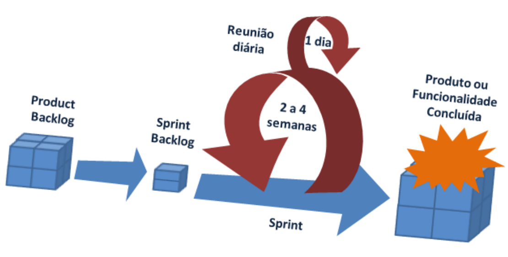

# Aula 01

```C
Conhecimentos:

- 1 Qualidade de software
  - 1.1. Definição
  - 1.2. Ferramentas
  - 1.3. Processos de trabalho
- 2 Metodologias de desenvolvimento

  - 2.1. Clássicas
    - 2.1.1. Definição
    - 2.1.2. Características
    - 2.1.3. Aplicabilidade
    - 2.1.4. Fases de desenvolvimento

    - 2.2. Ágeis
    - 2.2.1. Aplicabilidade
    - 2.2.2. Fases de desenvolvimento
```

Pensando no desenvolvimento de um projeto, é necessário seguir algumas práticas que foram padronizadas com o objetivo de garantir e melhorar a entrega do produto final. O Sucesso em um projeto bazeia-se quando o produto é entregue de acordo com o planejado, e que possua qualidade necessária para que possa ser produzido ou reproduzido.

A equipe do projeto é responsável por garantir que o produto seja entregue no prazo correto, respeitando os custos que foram determinados e com a qualidade necessária.

## São ferramentas pensando na Qualidade do Software:

* Trello
    * Ferramenta de gestão de projetos baseada em Kanban que permite organizar tarefas em quadros, listas e cartões.

* Jira
    * Descrição: Ferramenta de gestão de projetos amplamente utilizada que suporta metodologias ágeis como Scrum e Kanban, oferecendo rastreamento de problemas, planejamento e relatórios.

* Github
    * Descrição: Ferramenta utilizada para arquivamento de projetos.

* Microsoft Project
    * Descrição: Ferramenta de gestão de projetos que suporta o método de planejamento por diagrama de Gantt, permitindo o gerenciamento detalhado de cronogramas, recursos e orçamentos.

## São as fases de um projeto:

* Iniciação
* Planejamento
* Execução
* Encerramento

## Metodologias Clássicas:

- Benefícios
	- Organização (Clareza)
	- Planejamento
	- Execução
	- Controle
	- Nos levou a lua
	- Prineipais clientes (Bancos e Empresas aéreas)

## Metodologias ágeis
- XP
- SCRUM


- Product Owner (Dono do produto, Gerente do Projeto, Executivo do Projeto)
- Product BackLog (Escopo do projeto)
- Equipe de desenvolvimento:
	- Dev Full-Stack
	- Dev Back-End
	- Dev Front-End
	- Dev QA (Tester)
	- Dev DevOps (Implantação)
	- InfraEstrutura (Rede, Nuvem)
- Scrum Master (Responsável pela equipe e pelo sprint)
- Sprint (Semanal, quinzenal, mensal(implantação))
- Sprint Backlog (Escopo do Sprint)
- Daily huddle (Reunião diária (max 15min), (em pé))



- BackLog


- Benefícios
	- Versatilidade
	- Sprints (Planejamento, Execução, Controle)
	- Nos trouxe:
		- Facebook
		- Spotfy
		- Uber
		- Bancos digitais
		- Entre outros

Link: https://forms.gle/cmmSEUL5vGMR7LUJ7